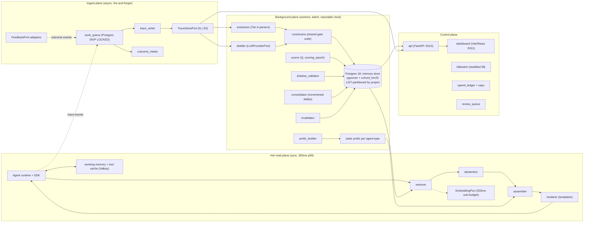

# Tracebed — Implementation Plan

Project-scoped learning memory for AI agents. Successor plan to `MEMORY_PLAN.md` (the "Strata" spec) with every correction from the July 2026 audit pass baked in. Where this plan and the original spec disagree, **this plan wins**; each disagreement is logged in `DECISIONS.md`.

Ports: API **8110**, dashboard **8111**. Repo: this directory (`Strata/`, to be renamed `tracebed`). Package: `tracebed`.

---

## §1 What Tracebed is

Tracebed is a standalone service that lets AI agents learn from their own runs: every run writes a raw trace, background workers distill traces into governed memories, and a fail-open hot path injects only memories that have earned the right to occupy context. It is memory *of running*, not a knowledge base: it stores conclusions, lessons, exemplars, and baselines derived from execution, never documents. Every derived memory points down to the raw trace that produced it, and any row without complete provenance is rejected at insert. Learning is two-lane: an LLM-free operational lane that works everywhere, and a quality lane that exists only where a feedback adapter exists — a guessed reward is worse than none, so ambiguous signals are logged and never scored. The project is the wall: isolation is enforced server-side at query construction, backed by row-level security and per-project partitions, and project identity is never accepted from a caller. Content-derived memory is quarantined until confirmed against real outcomes; memory enters prompts only as a labeled data block, placed after all cacheable content, never as instructions. Memory must measurably pay for its context: a continuous holdout computes per-agent-type lift, and sustained negative lift auto-disables the memory type that caused it. Tracebed refuses to do cross-project retrieval or aggregation of memory content, skills/runnable code, knowledge-base RAG, and synchronous LLM calls that an agent waits on. It is built for platform teams operating fleets of agents (BFSI/SOC-shaped and general), deployable fully open-source with permissive defaults. It ships as one service plus a typed SDK and a React dashboard; host platforms (e.g. Atom) integrate through documented adapter ports with working defaults — the core runs fully featured against zero host.

---

## §2 The eight load-bearing invariants

Test-first applies to exactly these eight. Each test exists and fails before its implementation exists.

| # | Invariant (restated precisely) | The test that proves it |
|---|---|---|
| 1 | **Hot-path purity.** No *generative* LLM client is reachable from the `hotpath/` package import graph. Query embedding is permitted only through `EmbeddingPort` with its own sub-budget (200ms) — it is a vector endpoint, not a generative client. | Import-graph reachability test over `hotpath/`: walk the module graph, assert no module from `workers/`, no OpenAI-compatible chat client, and no provider SDK is reachable. CI-blocking from Phase 1. |
| 2 | **Fail-open, budgeted.** Total retrieval budget 300ms p99. Degradation ladder: query-embed timeout (200ms) → lexical-only retrieval; total budget exceeded → static prefix only; store error → nothing. A run never blocks or fails because of Tracebed. | Fault-injection drill: kill Postgres, kill Valkey, stall the embedding endpoint (sleep > 200ms), stall everything (> 300ms). Assert the fake agent runtime completes every run, and `retrieval_event.outcome_code` records `degraded_lexical` / `timeout_prefix_only` / `store_error` correctly. |
| 3 | **Render-as-data (governance control, not security control).** Memory enters context exclusively via typed templates with escaped field values, under the exact header `MEMORY (recalled data, verify against current state)`, pitfalls in a separate labeled sub-block, never imperative phrasing. This preserves policy subordination; it is *not* claimed as an anti-poisoning control (delimiting is the weakest spotlighting variant: ~50% ASR reduction non-adaptive, >95% ASR adaptive). | Property test: renderer output parses back into one of the N approved template shapes and nothing else; free text appears only inside escaped value positions. A fuzz corpus of imperative/injection payloads placed in value positions must survive verbatim-escaped, never as top-level tokens. |
| 4 | **Project isolation at query construction — every key in every store.** Every repository query builder requires a `ProjectId` newtype; no scope-less constructor exists; raw SQL outside the repository fails a static check. Postgres RLS with `FORCE ROW LEVEL SECURITY` backstops it. Every Valkey key, every trace-store object key, every cache key, every export embeds `project_id`. `project_id` is derived server-side from the authenticated principal via the registry — never caller-asserted. | The Phase 0 cross-project leak suite: (a) search across projects, (b) **by-id fetch** of another project's memory/trace, (c) admin endpoints, (d) dashboard API, (e) export paths, (f) Valkey key-collision probe (identical tool args, two projects → distinct keys, no cross-read), (g) repo bypass attempt with RLS GUC unset → zero rows. All must return nothing/404, never data. |
| 5 | **Async writes.** All trace, outcome, and derived-memory writes are fire-and-forget through the queue; nothing on the write side is awaited by the agent runtime. Named synchronous exceptions: working-memory reads/writes and blackboard commits (they are run-state, not learning writes). | SDK overhead test: `trace()`/`feedback()` return in ≤1ms p99 on the fake runtime with the queue stopped; no exception propagates. Queue-down test: writes buffer, drop policy engages at capacity, counters record loss. |
| 6 | **Provenance-complete-or-rejected.** Any `memory_item` insert without complete provenance (source trace ids, or verdict id, per provenance class) is rejected at the repository layer. | Insert attempts with missing/partial provenance for every mem_type → typed rejection error; the row does not exist afterward. |
| 7 | **Tier B quarantine.** Nothing content-derived is retrievable until it exits quarantine through the one state machine: shadow confirmation (2 distinct runs from **distinct authenticated principals AND distinct input-signature clusters**; 1 for failure lessons) or verified-human-verdict provenance. `propose_memory` proposals are a provenance class that can never satisfy any skip. No admin bypass in code. | Table-driven state-machine tests covering every legal and illegal transition (the table in §5 is the source of truth); retrieval predicate test asserting quarantined/stale/superseded/retired/archived/tombstoned rows never appear in results; Sybil test: two proposals / two same-principal traces do **not** exit quarantine. |
| 8 | **No guessed rewards.** Q updates only from unambiguous outcomes: `Q ← clamp01(Q + α·w·c·(r − Q))` where `r` is outcome polarity in [0,1], `w` the adapter trust weight scaling the learning rate, and `w = 0` short-circuits (no update, no row). Ambiguous/implicit signals are logged on the trace and never scored. Callers never supply weights; the server derives `w` from the authenticated adapter class. | Guessed-reward test: implicit-behavior and ambiguous fixtures produce **zero** Q mutations (assert row-level equality before/after); a successful downstream event (r=1, w=0.3) must move Q *up*; a caller-supplied weight field is rejected at the API. |

---

## §3 Architecture

Four planes. The separation is the latency and cost story — with the caveat (recorded, monitored) that the ingest queue and the vector index share one Postgres buffer cache, so xmin-horizon bloat on the queue is a hot-path latency risk; the queue table is monitored for exactly that.



### Modules

| Module | Responsibility | Talks to |
|---|---|---|
| `domain/` | Newtypes (`ProjectId`, `RunId`, `PrincipalId`, `MemoryId`), the single state machine + transition table, typed config, event taxonomies | everything (pure, no I/O) |
| `core/scans/` | Shared gate suite: injection-pattern scan, secret scan, schema check, Tier-A template validator. **Every write path must present a `ScanVerdict` token to insert.** | repository insert API |
| `crypto/` | Per-subject crypto-shredding: subject KEKs, envelope encryption of trace payload sections, key destruction = tombstone | TraceStore, subject_key table |
| `stores/pg/` | Typed repository (scope-required builders), RLS session wiring, partition manager, work_queue | Postgres 18 |
| `stores/valkey/` | Working memory, tool cache, key schema `tb:{project_id}:…` | Valkey |
| `stores/tracestore/` | `TraceStorePort` drivers: filesystem (default), generic S3 (SeaweedFS-tested; legacy MinIO compatible) | object store |
| `hotpath/` | retriever (BM25 + ANN + RRF), abstention (calibrated raw signals), assembler (budgets, dedup), renderer (templates) — generative-client-import forbidden | stores, EmbeddingPort |
| `ingest/` | queue consumers: trace_writer, outcome_intake (attach-by-run_id, dedup, principal capture) | work_queue, TraceStore, Postgres |
| `workers/` | extractors, distiller, scorer, shadow_validator, consolidator, invalidator, prefix_builder, killswitch, gc — all take an injectable clock, all resolve inference through `LLMProviderPort`, all record `scoring_epoch` | stores, ports |
| `api/` | FastAPI :8110 — SDK routes, admin, auth, export, dashboard API. Scope derived server-side on every route. | everything |
| `sdk/` | Framework-agnostic client: plain functions + HTTP, local ring buffer, run-end sentinel, per-run sequence numbers | api |
| `adapters/` | The port definitions and shipped defaults (below), plus `adapters/atom/` as *documentation + typed stubs only* — no integration code | api, workers |
| `dashboard/` | React 18 + Vite + TS + Tailwind (:8111), matching Atom's frontend stack so views lift into its Command Center later | api |
| `harness/` | negative probes, latency bench (multi-project, concurrent), poisoning red team (4 probes), staleness injection, soak (simulated clock), lift sim, guessed-reward, ledger audit, leak suite | CI / gates |

### Ports (host-implements) and shipped defaults

The core must run, fully featured, against zero host. Every host-specific concern is one of these ports; each ships a working default.

| Port | Host implements | Shipped default |
|---|---|---|
| `PrincipalPort` | Verify caller identity | OIDC/JWKS verifier (Keycloak-compatible) **plus** API-key mode (hashed keys in Postgres). The service always verifies its own credentials; it never trusts a host's actor header. |
| `ProjectResolverPort` | principal → project_id | Registry tables (`project`, `agent_registration`) populated at agent-registration time via admin API. Caller can never assert scope. |
| `FeedbackPort` | Host events → outcome events | HTTP webhook endpoint with per-adapter mapping config + dashboard manual-verdict UI. Adapter classes: `verdict` (1.0), `correction_adapter` (0.8, inferred from output diff), `downstream` (0.3), `implicit` (0.0, logged only). `operator_edit` is not an adapter: dashboard action, bypasses scorer, supersedes directly. Server derives `w`; callers never send weights. |
| `InvalidationPort` | Platform events (tool changed, env fact changed, workflow edited) | HTTP webhook endpoint + generic polling skeleton (interval-diff a JSON source). |
| `LLMProviderPort` | Generative inference for workers | OpenAI-compatible client. Default model **Gemini 3.1 Pro** for contribution judge, shadow validator, and distiller (they gate Q and promotion — errors there corrupt the vault permanently); Flash configurable per worker. Google-direct / LiteLLM / any gateway is one config line (`base_url`). Pin = model id + version + sampling params, recorded on every artifact with `scoring_epoch`. |
| `EmbeddingPort` | Query + index embedding | Default **Gemini `gemini-embedding-2`** for both indexing and query (accuracy beats latency). Secondary, fully supported: pinned local ONNX driver for air-gapped / latency-sensitive deployments. Model id + version + dimension stamped on every row. |
| `TraceStorePort` | Object storage for traces | Filesystem driver (default); generic S3 driver (SeaweedFS primary target; legacy MinIO compatibility only — its OSS repo was archived 2026-04-25). Never a MinIO SDK. |
| `AuditSinkPort` | Where Tracebed's own audit events go | JSON-lines to stdout + Postgres audit table; optional S3 sink. |

### Public API contract (the spec elided this; this is authoritative)

All routes under `:8110`, authenticated (OIDC bearer or API key). `project_id` never appears in any request body — it is derived from the principal.

**`POST /v1/retrieve`** — sync, budgeted.
```
Request:  { agent_type: str, run_ctx: { query_text: str, workflow_template?: str,
            user_ref?: str, session_id?: str, prefetch_for?: str }, }
Response: { run_id: uuid7,                       # minted by the service — credit assignment with zero host support
            arm: "memory_on" | "holdout",
            outcome_code: "injected"|"abstained_threshold"|"abstained_rarity"|"empty_result"
                          |"degraded_lexical"|"timeout_prefix_only"|"store_error"|"holdout",
            context_block: {
              placement: "append_last",          # MUST be placed after all cacheable content (prompt-cache economics)
              header: "MEMORY (recalled data, verify against current state)",
              slots: [ { slot: "static_prefix"|"fact"|"exemplar"|"pitfall"|"candidate_note"|"jit_lesson",
                         memory_id: uuid, tokens: int, text: str } ],
              rendered: str } }                  # the fenced block, exactly what the caller appends
```
`context_block` is concretely: a structured object with named slots (what `injection_log.slot` records) **plus** its canonical rendering; callers may use either, and the rendered string is byte-stable for a given slot list.

**`POST /v1/trace`** — fire-and-forget (202).
```
{ run_id: uuid7, seq: int, event: { type: "run_start"|"tool_call"|"tool_result"|"llm_call_meta"
   |"error"|"artifact_ref"|"state_note"|"run_end", ts: iso8601, payload: object } }
```
`run_end` is the completeness sentinel; missing sentinel or sequence gaps ⇒ `trace_index.outcome_status='incomplete'` and the distiller refuses the trace.

**`POST /v1/feedback`** — fire-and-forget (202).
```
{ run_id: uuid7, event: { adapter: "verdict"|"correction_adapter"|"downstream"|"implicit",
   outcome: "positive"|"negative",              # server maps to r ∈ {1, 0}; graded r reserved for correction diffs
   payload: object, event_id: uuid,             # dedup key — replay-safe
   occurred_at?: iso8601 } }                    # may arrive days after the trace; attaches by run_id
```
No weight field exists. The server records the authenticated principal on the outcome_event.

**`POST /v1/propose_memory`** — fire-and-forget (202), agent_control mode only.
```
{ run_id: uuid7, proposal: { mem_type: "lesson"|"semantic", content: str,
   subject_tag?: str, claimed_scope: "agent_type"|"project_shared" } }
```
Always lands `quarantined` with `provenance.class = "proposal"` — a class that can never satisfy the corroboration or human-verdict skips. Rate-capped per run and per project.

Admin/registry (selected): `POST /admin/projects`, `POST /admin/agents/register` (binds principal → project → agent_type; this is what makes server-side scope derivation possible), `GET /admin/memory/{id}`, `POST /admin/memory/{id}/quarantine`, `GET /export/project` (single-project by construction), `POST /v1/invalidation`.

---

## §4 Repo layout

```
tracebed/
  pyproject.toml            # Python 3.13, FastAPI, Pydantic v2, psycopg 3, yoyo-migrations, pytest
  PLAN.md  DECISIONS.md  PHASE-0.md
  src/tracebed/
    domain/                 # newtypes, state machine + transition table, config module, event types
    core/
      scans/                # shared gate suite (injection, secret, schema, tier-A templates)
    crypto/                 # subject-key manager, envelope encryption (crypto-shredding)
    stores/
      pg/                   # typed repository, RLS wiring, partition manager, work_queue
      valkey/               # working memory, tool cache (key schema)
      tracestore/           # fs driver, s3 driver
    hotpath/                # retriever, abstention, assembler, renderer   [generative-import forbidden]
    ingest/                 # trace_writer, outcome_intake
    workers/                # extractors, distiller, scorer, shadow_validator, consolidator,
                            # invalidator, prefix_builder, killswitch, gc
    api/                    # FastAPI :8110 — sdk routes, admin, auth, export
    sdk/                    # client, ring buffer, sentinel, sequence numbers
    adapters/               # ports + shipped defaults: identity, project, feedback, invalidation,
                            #   llm, embedding, objectstore, audit
      atom/                 # documented interface stubs ONLY — the human writes the integration
  dashboard/                # React 18 + Vite + TypeScript + Tailwind  (:8111)
  harness/                  # negative_probes, latency_bench, redteam, staleness, soak, lift_sim,
                            # guessed_reward, ledger_audit, leak_suite
  migrations/               # plain SQL, yoyo-migrations
  tests/
  scripts/                  # license_check, raw_sql_lint (AST), purity_check
  docker/                   # compose: pg18(pgvector+vchord_bm25+pg_tokenizer), valkey, seaweedfs, api, dashboard
```

---

## §5 Data model

Postgres 18. Extensions: `vector` (pgvector, `halfvec`), `vchord_bm25` (true BM25) with `pg_tokenizer` for tokenization — the mandated `pg_textsearch` was a phantom extension that does not exist and was replaced — the `vchord_bm25`/`pg_tokenizer` extensions ship in migration 0001, their tokenizer config and the `content_bm25` ranking column in 0005 (D-140). All learning-plane tables **LIST-partitioned by `project_id`**.

### DDL sketch

```sql
-- Registries (unpartitioned; small)
project(project_id uuid PK, name text, status text, retention_policy jsonb, created_at, deleted_at);
principal(principal_id uuid PK, kind text CHECK (kind IN ('oidc_sub','api_key')),
          external_ref text, key_hash text, created_at, revoked_at);
agent_type(agent_type_id uuid PK, project_id uuid REFERENCES project, name text, created_at);
agent_registration(principal_id uuid REFERENCES principal, project_id uuid REFERENCES project,
          agent_type_id uuid REFERENCES agent_type, registered_at, UNIQUE(principal_id));
          -- THE isolation root: project_id is derived from this row, never from the request.

embedding_model(model_id text, model_version text, dim int, provider text,
          PRIMARY KEY (model_id, model_version));   -- pinned; re-embed migration = new row + backfill job
scoring_epoch(epoch_id int PK, judge_model_id text, judge_model_version text,
          sampling_params jsonb, prompt_hash text, started_at);
          -- every Q update and shadow confirmation records epoch_id; cross-epoch comparison is rejected.

-- Learning plane (ALL partitioned: LIST (project_id))
memory_item(
  id uuid, project_id uuid,
  scope_type text,  scope_id uuid,          -- agent_type | workflow_template | user | project_shared
  mem_type text,                             -- episodic | semantic | lesson | preference
  kind text, lane text, trust_tier char(1),  -- A | B
  status text,                               -- see state machine below (incl. pinned, tombstoned)
  content text, content_hash text, token_count int,
  embedding halfvec(768),                    -- dimension from embedding pin; <= 768
  embedding_model_id text, embedding_model_version text,   -- stamped per row; NOT NULL when embedding set
  lexemes tsvector,                          -- BM25 side; per-term document frequency for the vchord_bm25 arm (D-140)
  subject_tag text,                          -- user | third_party:<id> | entity:<id> | environment
  q_value float, confidence float,
  scored_use_count int, last_scored_at, strike_count int,
  shadow_confirm_runs uuid[],                -- distinct confirming run_ids (distinctness is checkable)
  cluster_id uuid, ttl_class text, pinned bool,
  last_retrieved_at, last_revalidated_at, status_changed_at,
  valid_from, valid_to, created_at, expired_at,
  provenance jsonb,                          -- {class: parser|distiller|human_verdict|proposal|operator,
                                             --  trace_ids[], verdict_id?, tool_refs[], input_sig_hashes[]}
  scan_verdict_id uuid NOT NULL,             -- proof the shared scan suite ran; inserts without it are rejected
  schema_version int,
  PRIMARY KEY (project_id, id)
) PARTITION BY LIST (project_id);

memory_link(project_id, src_id, dst_id, relation)    -- supersedes|derived_from|contradicts|related; partitioned
derived_state(                                        -- OUTSIDE the state machine (SM-05 resolution)
  project_id, agent_type_id, key text, version int, value jsonb, computed_at,
  delta_pct float, clamped bool,                      -- rate-bounded movement: |delta| <= baseline_max_delta_pct
  PRIMARY KEY (project_id, agent_type_id, key, version)
) PARTITION BY LIST (project_id);                     -- keep last N versions; clamp-binding alert + slow/fast divergence alarm

trace_index(
  run_id uuid, project_id uuid, agent_type_id uuid, workflow_template_id uuid,
  submitter_principal uuid NOT NULL,          -- Phase 0: without it "independent" is uncomputable (Sybil bypass)
  input_signature_hash bytea NOT NULL,        -- sha256(structured features) + 64-bit simhash(free-text head)
  instrumentation_source text,                -- sdk | host_stream — lift refuses mixed-coverage agent-types
  arm text,                                   -- memory_on | holdout — logged on the trace (kill-switch audit)
  path jsonb, started_at, ended_at, payload_ref text,
  outcome_status text,                        -- ...| incomplete  (sentinel/sequence-gap detection)
  PRIMARY KEY (project_id, run_id)
) PARTITION BY LIST (project_id);

trace_subject(run_id, project_id, subject_tag,        -- multi-valued; makes subjects findable for erasure
  PRIMARY KEY (project_id, run_id, subject_tag)) PARTITION BY LIST (project_id);
subject_key(project_id, subject_tag, key_id uuid, wrapped_kek bytea, created_at, destroyed_at,
  PRIMARY KEY (project_id, subject_tag)) PARTITION BY LIST (project_id);
  -- crypto-shredding: trace payload sections tagged with a subject are envelope-encrypted under that
  -- subject's KEK; destroying the KEK tombstones the content while the object stays byte-immutable.
  -- Erasure therefore coexists with an immutable/object-locked archive.

outcome_event(
  event_id uuid, run_id uuid, project_id uuid,
  principal_id uuid NOT NULL,                 -- authenticated; retirement requires >= K distinct principals
  adapter text, r float,                      -- polarity in [0,1], server-derived; w derived from adapter class
  payload jsonb, occurred_at, arrived_at,
  PRIMARY KEY (project_id, event_id)          -- replay-safe dedup
) PARTITION BY LIST (project_id);

injection_log(run_id, project_id, memory_id, slot text, score float, tokens int, injected_at,
  PRIMARY KEY (project_id, run_id, memory_id)) PARTITION BY LIST (project_id);
retrieval_event(run_id, project_id, outcome_code text, latency_ms int, embed_latency_ms int,
  candidates_considered int, top_score float, arm text, created_at,
  PRIMARY KEY (project_id, run_id)) PARTITION BY LIST (project_id);
  -- distinguishes abstention (system working) from timeout (system failing); lift reads this.

blackboard_entry(project_id, run_id, branch_id, author_agent, key, value_ref, status, created_at)
  PARTITION BY LIST (project_id);             -- Phase 4: author server-derived, UNIQUE(project_id,run_id,branch_id,key)
invalidation_event(project_id, event_type, selector jsonb, fired_at) PARTITION BY LIST (project_id);
spend_ledger(project_id, day, worker, model_id, tokens_in, tokens_out, cost_usd)
  PARTITION BY LIST (project_id);             -- org rollup is billing metadata, exempt from the aggregation ban
review_queue(project_id, item_id, reason, memory_id, opened_at, resolved_at, resolution)
  PARTITION BY LIST (project_id);
project_config(project_id, key, value jsonb);  agent_type_config(project_id, agent_type_id, key, value jsonb);
killswitch_state(project_id, agent_type_id, mem_type, disabled bool, evidence jsonb, changed_at);

-- Ingest (unpartitioned, transient, monitored for xmin bloat)
work_queue(id bigserial PK, project_id uuid, topic text, payload jsonb, priority int,
  available_at, lease_expires_at, attempts int, max_attempts int, created_at);
dead_letter(LIKE work_queue INCLUDING ALL, failed_at, last_error text);
```

### Tool-cache key spec (Valkey — the wall covers every key in every store)

```
tool cache:     tb:{project_id}:tc:{sha256(project_id ‖ tool_id ‖ tool_version ‖ auth_context_fingerprint ‖ canonical_args)}
working memory: tb:{project_id}:wm:{run_id}:{key}
static prefix:  tb:{project_id}:px:{agent_type_id}:{prefix_version}
```
`auth_context_fingerprint` prevents confused-deputy serving of high-privilege results to low-privilege callers. Per-project key sets are tracked for O(1) flush; a `cache_flush` invalidation event type exists from Phase 1.

### The one state machine (SM-01 reconciliation — table is the test source)

Statuses: `quarantined, candidate, validated, superseded, stale, retired, archived, pinned, tombstoned`. `Trace`/`Extracted` are not memory states (trace rows / transient). Tier A/B live in `trust_tier`, immutable after insert. `derived_state` is outside the machine (own table). `pinned` is the explicit ungoverned status for preferences only.

| From → To | Guard |
|---|---|
| ∅ → candidate | Tier A parser output, scan pass, provenance complete |
| ∅ → quarantined | Tier B (distiller or proposal), scan pass, provenance complete |
| ∅ → pinned | operator-created preference (provenance class `operator`) |
| quarantined → candidate | shadow-confirmed: ≥2 distinct runs, distinct principals AND distinct input-signature clusters (1 run for failure lessons). `proposal` class: **no skip ever applies**. *The "OR verified-human-verdict provenance" alternative this row used to name is NOT implemented and was removed from the guard (D-134, corrected by D-137): the insert door checks status membership and per-class provenance fields but never the creation guard, so a `quarantined` row carrying `human_verdict` provenance is constructible, and the skip was therefore a reachable zero-evidence exit from quarantine rather than the dead code it was first taken for. Restoring it needs an audited operator route with its own authenticated write path — §11.2 gap, not a code deviation.* |
| quarantined → archived | quarantine TTL (30d) expired |
| candidate → validated | promotion predicate: ≥`promote_min_outcomes` outcome-consistent observations from ≥2 distinct principals, scan re-pass, no open contradiction |
| candidate → quarantined | contradiction with weaker provenance, or scan re-flag |
| candidate → archived | candidate TTL (45d) unpromoted |
| validated → superseded | contradicted by equal/stronger provenance (link kept) |
| validated → stale | invalidation event, TTL class expiry, or revalidation fail (strike 1) |
| validated → archived | decay floor (0.15) reached |
| validated → retired | Q < 0.25 after ≥4 scored uses **from ≥K distinct principals**; otherwise → review_queue |
| stale → validated | re-verification pass |
| stale → retired | second strike |
| archived → validated | operator restore (recoverable, logged) |
| any non-terminal → tombstoned | subject erasure (crypto-shred) or review-queue-approved delete |
| everything else | **illegal** — table-driven tests assert rejection, incl. quarantined→validated directly |

Retrievable statuses: `validated`, `candidate` (Tier A only, labeled lower-trust, cap 1/run), `pinned` (prefix only). Nothing else, ever.

### Partitioning & isolation, concretely

1. **Typed repository (primary).** Every query builder takes `ProjectId` (a newtype; no scope-less constructor is exported). `scripts/raw_sql_lint.py` (AST walk) fails CI on any SQL execution outside `stores/pg/`.
2. **RLS backstop.** Every partitioned table: `ALTER TABLE … ENABLE ROW LEVEL SECURITY; FORCE ROW LEVEL SECURITY;` policy `USING (project_id = current_setting('tracebed.project_id')::uuid)`. The repo sets the GUC per transaction from the resolved principal. The service role is *not* table owner and holds no BYPASSRLS.
3. **LIST partitioning (lifecycle mechanism).** One partition per project per table → project deletion is `DETACH`/`DROP` across ~12 tables in one transaction, O(1) per table. **Ceiling: 1,000 projects per instance** (≈12k partitions; Postgres planner degradation begins in the low thousands). Documented migration path: switch new deployments to HASH partitioning (project deletion becomes bulk `DELETE` with the same repo API) once a deployment approaches the ceiling; the repository hides the strategy.

---

## §6 Config surface

One typed module: `domain/config.py` (`pydantic-settings`, env prefix `TB_`). Layered resolution, in order: process defaults → `project_config` → `agent_type_config` → `killswitch_state` overlay (read-only to callers). No magic numbers in code — every value below is a field.

| Field | Default | Corrected by |
|---|---|---|
| `api.port` / `dashboard.port` | 8110 / 8111 | — |
| `retrieval.total_budget_ms` (p99) | **300** | latency histogram, miss rate |
| `retrieval.embed_timeout_ms` | **200** | embed-latency histogram; on timeout → lexical-only |
| `retrieval.rrf_k` | **60** | retrieval quality vs abstention rate |
| `retrieval.rrf_weight_vector` / `rrf_weight_lexical` | 1.0 / 1.0 | per-arm nDCG on project fixtures |
| `retrieval.arm_top_n` / `fused_top_n` | 50 / 20 | recall probes |
| `retrieval.hnsw_iterative_scan` / `hnsw_max_scan_tuples` | on / 20_000 | filtered-ANN recall vs latency |
| `abstention.cos_threshold` | 0.60 | negative probes, lift |
| `abstention.bm25_sat_k` / `bm25_norm_threshold` | 10.0 / 0.50 | negative probes, lift |
| `abstention.rarity_min_shared_terms` | 2 | negative-probe false positives (target 0) |
| `abstention.rarity_max_df_pct` | 2.0 | same |
| `abstention.rarity_min_corpus_docs` | 200 (below → abstain; cold-start is conservative) | abstention rate on young projects |
| `abstention.target_abstention_pct` | ≥ 50 | false-injection probes |
| `score.w_sim` / `w_q` / `w_recency` / `w_validity` | 0.40 / 0.30 / 0.15 / 0.15 (calibrated raw signals — **never** RRF output; RRF orders, it cannot be thresholded) | per-project tuning vs outcome quality |
| `score.recency_half_life_days` | 14 | lift |
| `budget.total_tokens` | 1200 | lift-vs-tokens curve |
| `budget.static_prefix` (prefs / lessons) | 700 (200 / 500) | prefix cache hit rate |
| `budget.dynamic` (fact/exemplar/pitfall/candidate/jit) | 500 (250/150/100/100/150, fill ≤ 500) | abstention rate, lift |
| `embedding.model_id` / `model_version` / `dim` | `gemini-embedding-2` / pinned at deploy / **768 (halfvec)** | re-embed migration path only — never silently |
| `embedding.secondary_driver` | `onnx-local` (pinned model + hash) | air-gapped deployments |
| `llm.base_url` / `judge_model` / `distiller_model` | OpenAI-compatible endpoint / `gemini-3.1-pro` / `gemini-3.1-pro` (Flash per-worker configurable) | spend ledger, promotion quality |
| `scoring.alpha` | 0.3 | Q-trajectory stability |
| `scoring.adapter_weights` | verdict 1.0, correction_adapter 0.8, downstream 0.3, implicit 0.0 (short-circuit) | promotion/retirement rates |
| `scoring.updates_per_memory_per_day` | 1 (tie-break: highest-w adapter, then earliest arrival; replay-idempotent via event_id) | oscillation alerts |
| `scoring.q_start` | 0.5 | retirement and promotion rates |
| `scoring.contribution_rubric` | judge ∈ {0, 0.5, 1.0}, temperature 0, epoch-stamped | Q-trajectory stability |
| `retirement.q_threshold` / `min_scored_uses` | 0.25 / 4 | stale-retrieval rate |
| `retirement.min_distinct_principals` (**K**) | **3** (below K → review_queue, never auto-retire) | review-queue volume |
| `promotion.min_outcomes` / `failure_lesson_outcomes` | 2 / 1 | time-in-quarantine, red-team results |
| `lifecycle.decay_pct_per_idle_week` / `archive_floor` | 5 / 0.15 | vault growth-rate trend |
| `lifecycle.quarantine_ttl_days` / `candidate_ttl_days` | 30 / 45 | vault trend (bounded populations) |
| `lifecycle.revalidation_age_days` (R) | 30 | stale-retrieval rate |
| `derived.baseline_max_delta_pct` | **10** per update (clamp; alert if clamp binds 3 consecutive updates) | watchdog alert quality |
| `derived.divergence_alarm_pct` | 25 (slow 30d ref vs fast 24h ref) | baseline-poisoning drills |
| `derived.keep_versions` | 20 | debugging need |
| `proposals.per_run_cap` / `per_project_daily_cap` | **2 / 50** | review-queue volume |
| `tier_a.candidate_cap_per_run` | 1 (labeled) | candidate quality vs noise |
| `killswitch.holdout_pct` | 5 (salted deterministic hash, session-stable, never disables working memory or tool cache) | lift confidence intervals |
| `killswitch.trigger` | stratified lift (injected runs vs shadow-retrieved holdout), lower confidence bound < 0 sustained 14d, min cell N=200, BH correction | developer overrides |
| `spend.daily_llm_cap_usd` | 25.0 per project (on cap: workers pause + alert; hot path unaffected) | spend ledger |
| `cache.ttl_class` map | intel 24h, registry 14d | source freshness |
| `session.idle_ttl_min` / `offload_threshold_tokens` | 60 / 20_000 | working-memory metrics |
| `queue.lease_seconds` / `max_attempts` | 30 / 5 → dead_letter | queue depth, dead-letter rate |

---

## §7 The five phases

Rules of engagement: invariant tests (the eight in §2) are written first and fail before implementation. The latency bench is **built in Phase 1 but is not CI-gating from day one** — it produces a report at every gate; it becomes gating when the human flips it. DECISIONS.md logs deviations and dependencies, not micro-choices. Every phase ends with a STOP: present the gate assertions' output, wait for explicit human approval.

### Phase 0 — Trace substrate, isolation, and every structural security fix

Retrofitting these is expensive; all of them land here. Deliverables: migrations for all §5 tables (partitioned, RLS-forced); registries + server-side scope derivation; OIDC/JWKS + API-key auth; typed repository + raw-SQL lint; the **shared scan module** (`core/scans`) with insert-side enforcement; **crypto-shredding** (subject_key, envelope encryption, `trace_subject`); TraceStore fs + S3 drivers; SKIP LOCKED work_queue + trace_writer (sentinel, sequence gaps, `incomplete`); outcome_intake (attach-by-run_id days later, event_id dedup, **authenticated principal**); `submitter_principal` + `input_signature_hash` on trace_index (**corroboration skip ships disabled until both exist and Phase 3 turns it on**); injection_log + retrieval_event schemas; spend_ledger skeleton; typed config module; fire-and-forget SDK stubs (ring buffer, ≤1ms overhead); state machine + full transition table tests; license check (amended allowlist); the cross-project leak suite (Postgres + Valkey + by-id + admin + export).

**Gate (mechanically checkable):**
- `pytest -m phase0` green, including: fake-runtime run → complete queryable trace; outcome event posted at T+2 simulated days (injectable clock) joins by run_id; replayed event_id yields exactly one row.
- Leak suite: 0 leaks across all seven probe classes (§2 inv. 4).
- Scan suite: 100% of the strong-signal seeded corpus rejected; `memory_item` insert without a `ScanVerdict` raises.
- Crypto-shred test: destroy subject KEK → payload sections unreadable, object bytes unchanged, provenance pointers intact.
- State machine: table-driven tests cover every row of §5's table plus every enumerated illegal transition.
- SDK overhead on fake runtime ≤1ms p99 per call with queue stopped.
- License check green on the full dependency tree.

**Ordering hazards:** scan module before any write path exists (RT-03); registries + auth before any API route; crypto envelope before the first trace byte is written; state-machine table before any store code; license check on commit one (psycopg would otherwise fail the old allowlist).

**STOP.**

### Phase 1 — Hot path

Deliverables: Valkey working memory (lifetime knob) + tool cache with the §5 key spec and `cache_flush` invalidation; semantic/episodic stores with pinned Gemini embeddings (`halfvec`, model stamped per row) and BM25 lexemes; hybrid retrieval (BM25 arm + ANN arm, RRF k=60 for ordering); **abstention computed from calibrated raw signals** (cosine + normalized BM25 + rarity gate from per-term document frequency over the lexemes tsvector via the `@@`/`plainto_tsquery` operator — not vchord_bm25, which exposes no IDF accessor (D-140); cold-start abstains); assembler (budgets, dedup) + template renderer; the full degradation ladder (200ms embed → lexical-only; 300ms total → prefix-only; then nothing); `retrieval_event` written for every call; holdout plumbing (salted deterministic hash, session-stable, logged on trace, not yet acting); **JIT retrieval SDK hook** (`on_operational_event` — hook only, returns None; trigger logic Phase 2; CUTTABLE improvement 5); dashboard v0 (Injections view); latency bench built (**50 projects × 100k items, concurrent load** — the single-project warm fixture certifies a condition production never has).

**Gate:** negative probes: 0 dynamic injections. Purity test green (§2 inv. 1). Render property tests green. Fail-open drill green with correct outcome codes. Holdout: same (session, agent_type, salt) → same arm across restarts; working memory unaffected in holdout arm. Bench report produced and attached (informational). **STOP.**

### Phase 2 — Operational lane + staleness

Deliverables: Tier A parsers emitting **template + enum notes with zero byte passthrough** (error class enums, tool ids, hashes; raw text stays in the trace behind a pointer); derived_state writer with rate-bounded movement, clamp-binding alert, slow/fast divergence alarm; novelty gate (structural signature hash for the operational lane — LLM-free); consolidator using **structured incremental deltas, never rewrite-in-place** + consolidation regression harness (CUTTABLE improvement 4); invalidator (webhook/poller events with provenance selectors, TTL classes, usage-triggered revalidation at R, two-strike retirement); quarantine/candidate TTL sweeps; prefix builder (static block per agent-type; **dynamic memory block placed last** — after all cacheable content); JIT trigger logic (first tool error / schema failure → one matching lesson; CUTTABLE improvement 5); dashboard: Consolidation diffs, Staleness, Abstention, Vault trend.

**Gate:** seeded failure traces → expected Tier A notes, and **no substring ≥ 8 bytes from any tool error body appears in any note** (the Pydantic `input_value=` fixture is in the corpus). **Seeded injection payload in a tool error body never reaches candidate** (scan wired on the parser path — the Phase 3-only scan ordering bug is dead). Staleness injection green (flip tool def → dependents stale → two strikes retire). 30-simulated-day soak (injectable clock): **net vault growth rate strictly decreasing week-over-week, with a computed projected plateau date** (the observed-plateau gate was arithmetically unpassable: 0.5 → 0.15 at 5%/wk ≈ 164 days). Sweep cost measured to scale with vault size, not trace volume. Baseline-walk drill: monotone drift attack trips the clamp alert and divergence alarm. **STOP.**

### Phase 3 — Quality lane + learning

Deliverables: feedback adapters (verdict first; correction_adapter + downstream as interfaces with one reference implementation; implicit logged-only; `operator_edit` as dashboard action bypassing the scorer); distiller (Gemini 3.1 Pro via LLMProviderPort, batch, project-homogeneous batches, behind novelty gate + scan suite); scorer with the **corrected Q update** (`Q ← clamp01(Q + α·w·c·(r−Q))`), contribution judge (3-level rubric, temp 0), one-update-per-day cap with defined tie-break, **scoring_epoch stamped on everything**; shadow validator with the **computable independence definition** (distinct authenticated principals AND distinct input-signature clusters — GovMem measured naive counting at 0.597 false promotion) and the corroboration skip now enabled; promotion predicate live; review queue + edit ops (pin, delete-by-subject via crypto-shred, merge, operator_edit); kill switch acting (**lift stratified on runs where something was actually injected** vs shadow-retrieved holdout — with ≥50% abstention, aggregate lift is noise-vs-noise; conservative lower-bound trigger, BH correction, arm on the trace); retirement principal threshold K; **Recall & Rollback forensics** (CUTTABLE improvement 1); **safety-aware kill switch** (CUTTABLE improvement 2); **dependence test** (CUTTABLE improvement 3); Lift + Q-evolution dashboard views; spend enforcement.

**Gate:** guessed-reward test green (w=0 short-circuits; ambiguous → zero mutations; downstream success moves Q **up**). Four-probe red team, none reach validated: (1) MPBench weak-signal policy-conformant false precedent, (2) OEP locally-correct non-transferable, (3) sleeper with dormancy > quarantine TTL, (4) correlated-trace corroboration (same principal / same input-signature cluster). Sybil test: `propose_memory` twice ≠ corroboration. Retirement with K−1 principals routes to review_queue. Lift sim reports stratified lift with CI; **"operational lane only" is a documented passing outcome** (2026 evidence says it is the likely one). Ledger reconciles; cap pauses workers. Cross-epoch Q comparison rejected. **STOP.**

### Phase 4 — Workflow memory + polish

Deliverables: run blackboard (server-derived `author_agent`, `UNIQUE(project_id, run_id, branch_id, key)`, content-addressed immutable value_refs, propose→commit in transactions — a named synchronous exception to invariant 5; blackboard summary marked untrusted-origin, nothing derived from it enters Tier A); routing records (input signature hash + free-text-head embedding, retrieved as data); orchestrator prefetch API (measured before shipped); preferences/persona pinning (`pinned` status, explicit edit flow); agent_control mode (`propose_memory` live end-to-end with caps); Qdrant driver + Apache AGE hook behind interfaces (compile-tested, off by default); remaining dashboard views; operator docs, per-archetype configs, adapter-port authoring guide (the Atom seam documentation).

**Gate:** parallel-branch contention tests green (fixture-only — no host dependency); key-squatting test: proposed keys cannot shadow another agent's committed keys; end-only workflow verdict scores workflow-template scope only, **zero** per-agent Q changes; proposals never satisfy any skip (re-run from Phase 3); full CI green; DECISIONS.md current. **STOP. Final review.**

### Phase 5 — backlog only (§9). Never scheduled without a new human decision.

---

### Build status — appended 2026-07-26 (final integration pass)

Appended, not substituted: every phase description above is the plan as written and is left
intact. This table records what was actually built and what each gate actually returned on
the machine it was run on. **No phase returned FAIL.** Two verdicts read INCOMPLETE for one
reason only — this build environment has no Docker, Postgres, Valkey, S3 or LLM endpoint, so
`@pytest.mark.integration` tests skip cleanly rather than run. An INCOMPLETE here means "not
yet proven against a live stack", never "failed".

| Phase | Built | Gate verdict (this environment) | The one thing the verdict does not cover |
|---|---|---|---|
| 0 — Trace substrate, isolation, structural security | yes | **INCOMPLETE — 6/7 assertions PASS** | The cross-project leak suite (§2 inv. 4's seven probe classes) needs a real Postgres with RLS FORCE. It is written, and it is unrun here. |
| 1 — Hot path | yes | **INCOMPLETE — 6/7 assertions PASS** | The latency bench (50 projects × 100k, concurrent) needs Postgres. It is informational by design (D-010) and never gates the verdict — but it has produced no number on this machine. |
| 2 — Operational lane + staleness | yes | **PASS — 7/7** | — |
| 3 — Quality lane + learning | yes | **PASS — 9/9** | Clause 2's "no probe reached `validated`" is conditioned by D-085/D-086: all four probes terminate in `archived`, which is not a terminal status. |
| 4 — Workflow memory + polish | yes | **INCOMPLETE — 6/6 gate clauses PASS** | The only `-m phase4` skip is one pgvector test needing real Postgres. Every tracked clause passed. |

Full CI after the 2026-07-27 BMAD remediation pass (§11's D-129…D-139 block): `pytest -q` 4,276 passed /
45 skipped / 0 failed; `mypy` clean on 151 source files; `ruff check src tests harness scripts` clean; `raw_sql_lint`,
`purity_check` (now an allowlist, and `--root` works — D-101), `license_check`,
`license_check --dependency-audit` (D-104) and `image_check` (D-109) all PASS. The figures
above superseded a stale line reporting 3,592 passed / 139 mypy files; if you are reading this
and the numbers do not match a fresh run, the appendix is stale again — the run is the
authority, not this paragraph.

**Known open items carried past Phase 4.** This list used to be headed "none of them
silent", and it was not complete: it named six items and omitted the four largest gaps in the
tree (no status-write path; no writers for `memory_link`/`derived_state`/`killswitch_state`/
`scoring_epoch`; the unwired static prefix; the non-withholding holdout, since fixed as D-099).
**§11 below is now the complete list; this paragraph is the subset that was already known.**
Each is recorded at its own site as well as here: no consumer drains `invalidation_event` rows (`POST /v1/invalidation`
writes them; `workers.invalidator` is fully built and offline-tested but nothing feeds it, so
`cache_flush` and staleness selectors do not fire in a live deployment); `AuditSinkPort` has
no concrete implementation, so PLAN.md §3's "JSON-lines to stdout + Postgres audit table"
default does not exist; `PgVectorStore.upsert` raises, because no `memory_item.embedding`
write primitive was ever built; PLAN.md §5 defines no `routing_record` table, so Phase 4's
routing store is process-local; PLAN.md §6 has no `prefetch` section, so that module's three
bounds are required constructor arguments with no config home; `workers.scheduler` / `gc` and
the Phase 2 periodic passes are complete but are not given a cadence by any live process. The
`AgentControlRepoPort` gap closed in this pass (D-087), but the indexes those queries want do
not exist yet.

---

## §8 Improvements (proposed, individually vetoable)

Each is marked **CUTTABLE**: cutting it removes a bounded module and its tests, nothing else.

**Three of the five are no longer actually cuttable, and that is a defect in this section, not
in them.** Deleting `harness/dependence_test.py` breaks `harness/phase3_gate.py`'s assertion 8,
which that runner's own docstring elevates to CI-blocking even though no §7 gate clause names it
(see §11.3 E3); deleting `workers/safety_lift.py` breaks `tests/phase3/test_killswitch.py` and
`test_lift.py`; deleting `hotpath/jit.py` breaks `tests/phase1/test_assembly.py` and
`tests/phase0/test_config.py`. Improvement 4 (the consolidation regression harness) IS still
cuttable and was kept that way deliberately: `harness/phase2_gate.py` does not import it, which
is why that harness is invoked by its own pytest module and by nothing else. Restoring
cuttability for the other three means guarding those imports; until someone does, treat the
CUTTABLE label on 1, 2, 3 and 5 as a statement of intent rather than of fact.

1. **Recall & Rollback — memory forensics** *(Phase 3, dashboard view)* — **CUTTABLE.** Quarantine a memory → enumerate every run it touched via `injection_log` → flag derived descendants via `memory_link` → re-open affected outcomes → emit a blast-radius report. The data model already supports it; this is the headline differentiator ("now what" after a poisoned memory reached validated).
2. **Safety-aware kill switch** *(Phase 3)* — **CUTTABLE.** Measure policy-violation rate memory-on vs memory-off alongside task quality. Benign accumulation degrades safety with no attacker (violation rates 0.3–0.5 for broad-retrieval architectures; drift is statistical, so render-as-data cannot touch it).
3. **"Can it still walk" dependence test** *(Phase 3 harness, then scheduled)* — **CUTTABLE.** Invariant "memory is an enhancer, never a dependency" is otherwise untested; documented production failure is agents becoming dependent. Periodically run the memory-off arm and assert task completion.
4. **Consolidation regression harness** *(Phase 2)* — **CUTTABLE** (the incremental-delta consolidator itself is not; only the harness is). ACE (ICLR 2026) names brevity bias and context collapse as failure modes of exactly the nightly merge loop; the harness asserts information retention across simulated sweeps.
5. **Just-in-time retrieval** *(SDK hook Phase 1, trigger logic Phase 2)* — **CUTTABLE.** A second retrieval checkpoint fired by an operational event (first tool error, first schema failure) injecting the one lesson matching that failure.

---

## §9 Phase 5 backlog — list only, do not build

- Counterfactual judge prompts for shadow validation (answers OEP-style locally-correct poisoning, arXiv:2605.18930).
- Consensus-at-retrieval checking (A-MemGuard, arXiv:2510.02373).
- Post-hoc detoxification / suspect-memory ranking (MemAudit, arXiv:2605.23723).
- Embedding-space attack defenses — hubness/centroid monitoring (Black-Hole, arXiv:2604.05480).
- Memory-extraction defenses — the read side of the threat model (MEXTRA, ACL 2025).
- Cost-exhaustion controls beyond the spend cap (Clawdrain, arXiv:2603.00902).
- Per-agent retrieval rate limits and enumeration-pattern detection.

---

## §10 What Tracebed will never do

- Cross-project or cross-org **retrieval or aggregation of memory content or memory-derived statistics**, including "anonymized" ones. (Spend/token/latency metering may roll up to org — billing metadata, explicitly exempt.)
- Accept `project_id`, feedback weights, or arm assignment from any caller.
- Concatenate memory text into system-prompt instructions; memory is a labeled data block, placed after all cacheable content.
- Change a memory's status outside the state machine — no admin bypass exists in code (erasure and operator actions are themselves transitions).
- Make a synchronous generative-LLM call any agent runtime waits on.
- Store or execute runnable code / skills (export-hook suggestion event only). Knowledge-base RAG over documents.
- Score from ambiguous signals, unpinned models, or across scoring epochs.
- Ship a ReMe compatibility shim, or claim render-as-data as an anti-poisoning control.
- Swap the embedding model silently — re-embedding is an explicit, versioned migration.

---

## §11 Known gaps against the original spec

Added 2026-07-26 after a nine-dimension fidelity audit (`docs/FIDELITY-AUDIT.md`) compared this
tree against the original build prompt and `MEMORY_PLAN.md`. The audit's verdict: **the rules
were built with unusual fidelity and the runtime was not.** Every invariant, guard, formula,
threshold and template the plans name exists as correct, typed, tested code — and the learning
half is a library rather than a service.

This section exists because the "none of them silent" list above was itself incomplete: it named
six open items and omitted the four largest gaps in the tree. Everything below is either a
promise this repository has not kept or surface area nobody asked for. Sizes are engineer-days
for someone who knows this codebase. Nothing here is scheduled; the user decides.

### 11.1 The learning plane — the absence, and what closed on 2026-07-27

**Updated after the integration pass recorded in `docs/FIDELITY-AUDIT.md` §12 and D-128.**
Rows that are now closed have been REMOVED from the table below rather than annotated, so this
list stays readable as a live inventory instead of an archive; what closed each one is recorded
immediately below, once, and in the audit's §12.1 in full.

**Closed by the integration pass (2026-07-27):**

* **M1 — the status write path.** `stores.pg.lifecycle.LifecycleWriter` is the one
  `UPDATE memory_item SET status`, and it is now REACHED: `MemoryEditRepo`/`ForensicsRepo`
  (same module) are the first production implementations of the two Protocols whose only
  implementations were three test fakes, and both delegate `persist_status` to it. Every write
  also appends a `memory_status_log` row in the same transaction.
* **M6 — the shadow-confirmation producer.** `stores.pg.learning.CorroborationRepo` gives
  `CorroborationWriter` a real store. *Caveat, and it is why the job is not scheduled by
  default:* deciding WHICH run corroborates WHICH memory is a declared host seam (D-121) with
  no implementation anywhere.
* **M8 — the embedding write.** `stores.pg.learning.EmbeddingRepo` implements the select/write
  pair; the sweep runs on `workers.embedding_interval_minutes`. The ANN arm can hold data.
* **The cadence contract gap** that `scheduler.py`, `runner.py` and `registry.py` each recorded
  identically — `domain.config.WorkersConfig` now carries every interval.
* **Two Benjamini-Hochberg implementations** (D-095's residue, D-126's contract gap) —
  `workers/killswitch.py` imports the exact one and defines none.

**Closed by the BMAD remediation pass (2026-07-27), D-129 to D-139.** These are defects the
head-to-head evaluation in `docs/BMAD-EVALUATION.md` surfaced, not spec gaps; they are listed here
because §11.2 previously carried three of them as "unenforced rather than unbuilt".

* **Invariant 2 was enforced against exceptions only, never against hangs** — the top BMAD
  finding. Closed in three layers and, critically, WIRED at every call site (D-132, D-138,
  D-139): the retriever's arm waits are bounded against one re-derived deadline, its work queue
  has admission control so a stalled store cannot leak a queue entry per request, and
  `statement_timeout` now reaches Postgres — derived from `retrieval.total_budget_ms`, issued
  transaction-scoped by `stores.pg.search`, so it can neither drift from the client-side bound
  nor leak onto the background plane. `create_pool` also bounds connection establishment and
  pool checkout from `StorageConfig`, at both `api/main.py` and `workers/runner.py`.
* **`get_killswitch_overlay` could not see a project-wide kill switch** (D-129). The predicate
  matched one scope, so a NULL-`agent_type_id` row — the project-wide overlay the migration
  defines — was invisible to every agent-scoped resolution while the admin surface reported it
  applied. Either row saying DISABLE now wins; the dashboard folds the same precedence into what
  it renders (D-139), so a row recorded ENABLED under a project-wide DISABLE no longer reads as
  "Enabled".
* **The `trace_index` upsert rewrote the independence evidence** (D-130, D-135). The three
  identity columns are now pinned — `agent_type_id` and `submitter_principal` first-write-wins,
  `input_signature_hash` a ONE-WAY sentinel upgrade, because that column has a sentinel and
  first-write-wins would have pinned a run at `ABSENT_SIGNATURE` whenever the first batch to land
  carried no `run_start`.
* **`ABSENT_SIGNATURE` read as maximally independent evidence** (D-131, D-136, D-139). Missing
  evidence is now excluded where a run becomes evidence, and KEPT where the set exists to refuse
  evidence — both legs, including the one-identity self-replay the first fix opened.
* **`/export/project` shipped the embedding vector and tsvector** (D-133, D-137). Every exported
  table has an explicit column list, and the control asserts the STATEMENT rather than the
  constant feeding it.
* **The isolation gate could not fail for the reason it was written** (D-139). It accepted any
  statement whose params bound `project_id` without checking the SQL used it; five predicate
  deletions had survived the whole suite. It now requires the placeholder in the statement text,
  for every `Repo` method, with no allowlist.

**Still open:**

| # | Gap | Evidence | Size |
|---|---|---|---|
| M2 | **Half-closed.** A periodic plane now exists — `workers/composition.py` + a `Scheduler` thread in `runner.run()` — but only **3 of 14** periodic workers are schedulable (`embedder`, `gc`, and `corroboration` given a host-supplied candidate source). The other ELEVEN are refused BY NAME with the port each is blocked on in `composition.UNSCHEDULED_WORKERS`, and `build_scheduled_jobs` raises rather than returning a shorter list | `workers/composition.py::UNSCHEDULED_WORKERS`; `harness/closed_loop.py` prints it beside its verdict | 3–5 d, and it is entirely M3 |
| M3 | **4 of 10 closed.** `EmbeddingRepoPort`, `CorroborationRepoPort`, `MemoryEditRepoPort`, `ForensicsRepoPort` now have Postgres implementations. Still declared only in the worker that consumes them: `MemoryLifecycleRepoPort`, `ScorerRepoPort`, `ShadowValidatorRepoPort`, `PromotionRepoPort`, `KillswitchStorePort`, `DerivedStateStorePort`, `EpochStorePort` | `stores/pg/learning.py`, `stores/pg/lifecycle.py` for the four; the rest are still worker-local Protocols | 4–6 d |
| M4 | Four §5 tables have no writer | `memory_link`, `derived_state`, `killswitch_state`, `scoring_epoch` (plus `agent_type_config`) are created, partitioned and RLS-protected and never written. `memory_item.epoch_id` and `memory_status_log.epoch_id` now exist, typed and empty — the column is there, the writer is not | inside M3 |
| M5 | Static prefix is never delivered | `hotpath/pipeline.py` never consults it on the happy path, `api/main.py` passes no `static_prefix=`, and no class implements `StaticPrefixPort` — so the `timeout_prefix_only` rung returns an empty block and pinned preferences are unreachable | 1–2 d |
| M6b | No `CorroborationCandidateSource` | the writer exists and is constructed; nothing decides which run corroborates which memory (D-121, a declared host seam). Until a host supplies one the corroboration job is built and left unscheduled | 1–2 d, or a host decision |
| M7 | No credit assignment | no query joins `outcome_event` → `trace_index` → `injection_log` → `memory_item`; `run_scorer_batch` has no production caller | 2–3 d |
| M9 | No episodic memory | the enum value is occupied by Tier A operational notes, which then render under the EXEMPLARS label; the distiller refuses episodic outright | 3–5 d |
| M10 | No contradiction detection | `workers/consolidator.py` explicitly refuses semantic comparison; `open_contradiction` is a caller-supplied field, so "never last-write-wins" rests on the caller | 3–5 d |
| M11 | No session-scoped or paused-workflow working memory (the "lifetime knob") | Valkey keys are run-scoped; `session_id` reaches no store. This is also the one thing ReMe actually did — see `docs/ADAPTER-GUIDE.md`'s ReMe parity section | 2–3 d |
| M12 | No audit sink at all | `AuditSinkPort` has zero implementations, no migration creates an audit table, and `workers/killswitch.py`'s optional `audit=` parameter has zero call sites. No governance action is recorded anywhere | 1–2 d |
| M13 | No memory-edit or quarantine write routes | `api/admin.py` has exactly two POSTs (`/admin/projects`, `/admin/agents/register`); `POST /admin/memory/{id}/quarantine` named in §3 does not exist | 1–2 d |
| M14 | No `memory.mode` / per-type opt-in developer surface | MEMORY_PLAN §16's surface exists nowhere; §6 dropped it too. This is what `POST /v1/propose_memory`'s missing mode check (D-116) depends on | 2–3 d |
| M15 | No memory TTL classes | the column and the state-machine evidence flag exist; no producer, no durations, no sweep | 1 d |
| M16 | No export-hook suggestion event | the one thing the skill carve-out positively requires; `grep -i skill src/` returns nothing | 1 d |
| M17 | No policy-suggestion channel | §1 invariant 3's affirmative half | 1–2 d |
| M18 | JIT retrieval is built and wired nowhere | `hotpath/jit.py` is complete and tested; `sdk/client.py` still returns `None` from the hook | 0.5 d |
| M19 | No durable `routing_record` | the store is process-local, unbounded, and empty after restart | 1 d |
| M20 | Per-project trace retention is inert | `project.retention_policy` is written at creation and read by nothing | 1 d |
| M21 | No blackboard death or end-of-run trace summary | no cleanup, no TTL, no GC, no summary writer | 1–2 d |
| M22 | Workflow-scope credit rule lives only in the harness | nothing in `src/` inspects `scope_type` when scoring | inside M7 |
| M23 | `embedding.driver = "onnx-local"` raises | the air-gapped escape hatch D-007/D-008 sell does not work (D-107) | 2–3 d |
| M24 | No commits | the tree is entirely untracked, which makes test-first ordering and DECISIONS.md's append-only guarantee permanently unverifiable (D-111) | 0.1 d |

### 11.2 Deviations now logged, still open

Each has a DECISIONS entry as of this pass; the entry explains the choice, it does not close the
gap. D-097 (retrieval scope predicate is applied in the assembler, not in SQL, and workflow- and
user-scoped memories are visible to nothing until a resolver exists), D-105 (RLS policy text),
D-106 (`candidate → validated` is stricter than §5), D-107 (`embedding.driver`), D-113
(revalidation is idle-triggered, not usage-triggered), D-114 (the blackboard writes one status,
not three), D-115 (deployment archetypes substituted for §16's seven agent archetypes), D-116
(`propose_memory` has no mode check), and D-095's residue: `api/reports.py` recomputes
Benjamini-Hochberg alongside `workers/killswitch.py`, so one governing correction has two
implementations. Collapsing those two onto one function is ~0.5 d and should happen before the
kill switch acts on production data.

Three further items are unenforced rather than unbuilt: `project_config`, `agent_type_config`
and `killswitch_state` are unpartitioned with no RLS despite §5 printing them under the "ALL
partitioned" heading (~1 d); budget dedup compares candidates against each other only, never
against content already in the caller's context, because no wire field carries it (~1 d); and
`prefetch_for` is accepted at the API boundary and dropped before it reaches anything (~0.5 d).

Two more joined this list from the BMAD remediation pass, both named where a reader meets them
rather than only here. **The insert door enforces no creation guard.** `Repo.insert_memory_item`
runs `assert_legal_creation_status` (status membership) and `validate_provenance` (per-class
fields) and never `apply(None, status, evidence, limits)`, so every §5 creation-edge guard — Tier,
`scan_passed`, `provenance_complete`, `operator_created` — is convention at the repository
boundary rather than mechanism. This is the general form of D-137's human-verdict finding and it
also covers BMAD's B19 (operator-created `pinned` rows skip the content scan). Closing it needs
the creation evidence four worker modules assemble, so it is a change to those modules and not to
`repo.py` alone (~2 d). **The Qdrant driver has no server-side bound.** `QdrantVectorStore
.ann_search` accepts `statement_timeout_ms` and documents it as unused, because
`_QdrantClientPort.search` exposes no timeout and this environment cannot exercise Qdrant's HTTP
API; on that driver the hot path is bounded client-side only, which is the pre-D-139 state.
pgvector is the shipped default and does forward it (~0.5 d).

### 11.3 Built but never requested

Unrequested surface area this repository now owns and must maintain. None of it is deleted —
the decision is the user's.

| # | Item | Size | Note |
|---|---|---|---|
| E1 | `dashboard/src/views/{Overview,Health,Projects,Settings}.tsx` | ~90 KB TSX | In neither plan. `Projects.tsx` and `Settings.tsx` surface admin registry provisioning and bootstrap-key credential entry — a governance surface no document asked the dashboard to own. The one to decide about first is `Settings.tsx`'s credential paste-in. |
| E2 | `src/tracebed/workflow/` (`agent_control`, `blackboard`, `prefetch`, `routing`) | 4 modules | Prompt-mandated Phase 4 *function* in a placement neither the prompt's layout nor §4's tree lists. Low risk; the alternative is a rename. |
| E3 | Phase 3 gate assertion 8 (the dependence drill) elevated to CI-blocking | — | Appears in no §7 gate clause. This is the mechanism by which a CUTTABLE improvement stopped being cuttable — see §8's note. |
| E4 | `promotion.min_distinct_principals` as overridable config | — | §5 states the count as a literal. Floored at 2 so it can only be raised, but it moves a governance threshold into `project_config`. |
| E5 | `api.workers` config field | — | Zero readers anywhere: setting `TB_API__WORKERS=8` produces neither workers nor an error. `dashboard.port` is the same shape (the real port is a literal in `vite.config.ts` and `compose.yaml`). |
| E6 | Top-level `docs/` (7 files, including a checked-in `MEMORY-FLOW.html`) | — | Absent from §4's tree; arguably implied by the Phase 4 "operator docs" task. |

### 11.4 Process

The five phase STOPs did not happen: all six gate reports were generated inside 58 seconds after
Phase 4 was complete, and no approval record exists in any form (D-111). Everything from roughly
D-038 onward was decided without the review that was supposed to gate it. **The worker plane
(M1–M4) should be its own phase with a real STOP before it starts.**

**Updated 2026-07-27.** That STOP did not happen either. The integration pass recorded in
`docs/FIDELITY-AUDIT.md` §12 built the composition root, four store implementations and the
closed-loop drill without one. What it did NOT do is close M3's remaining six ports, which is
the larger half of the same phase — so the STOP is still available, and it is now in front of a
smaller and much better-specified piece of work than it was: `composition.UNSCHEDULED_WORKERS`
names every remaining worker and the exact port that blocks it, and `harness/closed_loop.py`
already exercises each of those workers' logic against an in-memory implementation of the port
that has to be written.

**One measurement nobody had taken (now taken).** As of the integration pass this read: not a
single `@pytest.mark.integration` test in this repository had ever executed, and every SQL
statement in `stores/pg/` — including the eight added by that pass — had been parsed, structurally
asserted, and never run against Postgres.

**Superseded — live bring-up, 2026-07-27.** That measurement has now been taken. A live
Postgres 18.3 stack is up; migrations 0001..0006 apply against it; the full suite runs green
against the live stack (4,403 passed / 1 skipped — the S3-env case / 0 failed), with `mypy
--strict` (158 files) and `ruff` clean; and the cross-project leak suite passes 7/7 under the
`NOBYPASSRLS` app role. The SQL in `stores/pg/` is no longer only structurally asserted — it
executes against a real database.
