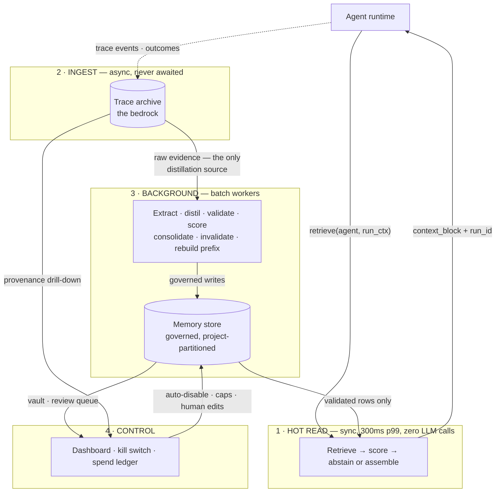

<div align="center">

# Tracebed

**Project-scoped learning memory for AI agents.**

Memory whose purpose is that agents *get better at their job over time* — not a knowledge base
with a vector index bolted on.

[](#the-gates)
[](#the-gates)
[](#the-gates)
[](#licence)
[](#quick-start)
[](#quick-start)

</div>

---

## Read this first

This repository is **honest about being unfinished in a specific way**, and that shape matters more
than any badge above.

> The **rules** were built with unusual fidelity. The **runtime** was not.
>
> Every invariant, guard, formula, threshold and template exists as correct, typed, tested code. The
> state machine matches the plan row for row. The project wall is a type-level constraint. Provenance
> rejection fires before the INSERT is built.
>
> **The learning half was a library, not a service.** There was no `UPDATE memory_item` statement
> anywhere in `src/`. The worker process started with `handlers={}`. Nothing wrote an embedding, so
> the ANN arm of "hybrid retrieval" could never have data. Nothing appended `shadow_confirm_runs` —
> the only non-human route out of quarantine.
>
> **A Tracebed deployed today ingested traces and outcome events faithfully, and learned nothing
> from either.**

That paragraph is from [`docs/FIDELITY-AUDIT.md`](docs/FIDELITY-AUDIT.md) — a 472-item audit of the
built system against its own specification. It found **325 matches, 25 logged deviations, 49 silent
deviations and 23 missing items**.

**It is written in the past tense because an integration pass on 2026-07-27 closed part of it
([audit §12](docs/FIDELITY-AUDIT.md), D-128) — and only part.** Here is the whole of the current
answer, in three sentences:

> A status change now reaches a column, an embedding now reaches a row, and a shadow confirmation
> now reaches an array — each through exactly one statement, each with a real Postgres
> implementation of the port its worker declared, and the worker process now runs a scheduler
> thread that drives them.
>
> **But 10 of the 13 periodic workers still cannot be scheduled**, because the store port each one
> takes has no Postgres implementation: the *shadow validator*, the *scorer* and the *promotion*
> worker among them — which are precisely the three stages between "evidence recorded" and
> "validated memory".
>
> So a deployed Tracebed today **records the evidence a memory needs to graduate, and cannot yet
> graduate it.** `python harness/closed_loop.py` walks all nine hops end to end and passes — offline,
> against in-memory implementations of the missing ports — and prints the ten unscheduled workers
> beside its own verdict so that PASS cannot be mistaken for "the learning plane is live".

Everything below is written on the assumption you would rather know that on line 30 than discover it
on day three.

<details>
<summary><b>What is actually finished, and what is not</b> — click to expand</summary>

<br>

| Layer | State | Evidence |
|---|---|---|
| Domain model, state machine, invariants | **Complete** | 9 statuses, full transition table, exhaustive product tested |
| Isolation (typed repo + FORCE RLS + partitions) | **Complete** | Type-level; verified by signature introspection |
| Scan suite, crypto-shredding, trace store | **Complete** | 5-file adversarial corpus; AES-256-GCM envelope, AAD-bound |
| Hot read path (retrieve → abstain → assemble → render) | **Complete** | 32 negative probes, 0 injections; 6-way fail-open drill |
| SDK, ingest, queue, telemetry | **Complete** | 0.04 ms p99 hot-path overhead with the server down |
| Tier A parsers, derived state, invalidation, sweeps | **Complete** | Zero byte passthrough proven over a rolling 8-byte window |
| Scorer, judge, shadow validation, promotion, kill switch | **Logic complete** | Correct and tested — **but not schedulable; see below** |
| **Persisting a status change** | **Complete** | `stores/pg/lifecycle.py` — one `UPDATE memory_item SET status`, plus a `memory_status_log` row in the same transaction. Reached through `MemoryEditRepo`/`ForensicsRepo` |
| **Embedding writes** | **Complete** | `stores/pg/learning.py::EmbeddingRepo`; swept on a config cadence. A pin change re-selects every row — that IS the re-embedding migration |
| **`shadow_confirm_runs` writer** | **Complete** | `stores/pg/learning.py::CorroborationRepo` — a `FOR NO KEY UPDATE` CTE reporting appended / already-present / row-not-eligible |
| **Worker process: periodic plane** | **Partial (3 of 13)** | `workers/composition.py` + a `Scheduler` thread in `runner.run()`. Scheduled: embedder, gc, corroboration (given a host-supplied candidate source). The other ten are refused **by name** with the port that blocks each |
| **Postgres implementations of the worker ports** | **Partial (4 of 10)** | Done: `EmbeddingRepoPort`, `CorroborationRepoPort`, `MemoryEditRepoPort`, `ForensicsRepoPort`. Missing: `ScorerRepoPort`, `ShadowValidatorRepoPort`, `PromotionRepoPort`, `KillswitchStorePort`, `DerivedStateStorePort`, `MemoryLifecycleRepoPort` |
| **`q_history`, consolidation-diff table, `memory_link` over HTTP** | **MISSING** | Views for these render honest empty pages |
| **Any integration test, ever** | **NEVER RUN** | No Docker/Postgres/Valkey/S3 on the build machine. All 12 SQL statements in `stores/pg/learning.py` + `lifecycle.py` are parsed and structurally asserted, never executed |
| Dashboard (16 views, React 18 + Vite + TS + Tailwind) | **Complete** | Zero fixture data; every view live or honestly empty |

**Consequence:** the pieces that *decide* were always done. As of 2026-07-27 several pieces that
*remember the decision* are done too — but the three stages that turn recorded evidence into a
validated memory (shadow validator, scorer, promotion) still have no store, so they run in the
closed-loop drill and in no deployment. What remains is bounded and specified one worker at a time
in `workers/composition.py::UNSCHEDULED_WORKERS`; the columns, the partitions and the RLS policies
all already exist. Written up in [`PLAN.md`](PLAN.md) §11 and [audit §12](docs/FIDELITY-AUDIT.md).

</details>

---

## What Tracebed is

Every agent run writes a raw trace. Background workers distil traces into governed memories. A
fail-open hot path injects only the memories that have earned the right to occupy context.

It is memory **of running**, not a knowledge base. It stores conclusions, lessons, exemplars and
baselines derived from execution — never documents. Every derived memory points down to the raw
trace that produced it, and any row without complete provenance is **rejected at insert**.



**Four planes.** A synchronous hot read plane on a 300 ms p99 budget with no generative LLM call in
its import graph. An ingest plane where every write is fire-and-forget. A background plane of batch
workers that do the actual learning. A control plane: dashboard, kill switch, spend ledger.

**Two lanes.** An LLM-free operational lane that works everywhere, and a quality lane that exists
only where a feedback adapter exists. *A guessed reward is worse than none*, so ambiguous signals are
logged and never scored.

**Two trust tiers.** Tier A is parser-derived and structural. Tier B is content-derived and
quarantined until confirmed by ≥2 runs from **distinct principals *and* distinct input-signature
clusters** — both, because either alone is trivially forged.

**The project is the wall.** `project_id` is derived server-side from the authenticated principal and
is *never* accepted from a caller.

---

## The eight invariants

These are the load-bearing promises. Each has a proving test; the audit checked whether each test
would actually go red if the invariant broke.

| # | Invariant | Enforced by | Proof |
|---|---|---|---|
| 1 | **Hot-path purity** — no generative client reachable from `hotpath/` | `scripts/purity_check.py`, import-graph reachability with a third-party **allowlist** | CI-blocking |
| 2 | **Fail-open, budgeted** — 300 ms p99, degradation ladder, never blocks a run | `hotpath/pipeline.py` + `budget.py` | 6-way drill, 0 exceptions ⚠️ *simulated clock* |
| 3 | **Render-as-data** — memory enters context as a labelled data block, never instructions | `hotpath/templates.py` closed grammar | 40-payload fuzz corpus |
| 4 | **Project isolation at query construction** | Typed repo (no scope-less constructor) + `FORCE ROW LEVEL SECURITY` + LIST partitions | 7-class leak suite ⚠️ *needs Postgres* |
| 5 | **Async writes** — nothing on the write side is awaited | SDK ring buffer | **0.04 ms p99** with the API down |
| 6 | **Provenance-complete-or-rejected** | `validate_provenance` before the statement is built + `NOT NULL` backstop | Exhaustive class × field matrix |
| 7 | **Tier B quarantine** — nothing content-derived is retrievable until confirmed | One state machine, no admin bypass, `PROPOSAL` hard-coded to satisfy no skip | 4-probe red team |
| 8 | **No guessed rewards** — `Q ← clamp01(Q + α·w·c·(r − Q))` | `workers/scorer.py`, `w = 0` short-circuits | Verified by hand arithmetic |

> **On invariant 3, stated plainly:** render-as-data is a *governance* control, not an anti-poisoning
> one. Delimiting is the weakest spotlighting variant — ~50% ASR reduction non-adaptive, >95% ASR
> adaptive ([arXiv:2403.14720](https://arxiv.org/abs/2403.14720)). The code says so where an engineer
> will read it.

---

## The gates

Five phase gates plus an aggregate. **The overall verdict is `INCOMPLETE`, and that is the correct
reading** — not a soft pass.

| Gate | Verdict | Why |
|---|---|---|
| Phase 0 — trace substrate, isolation, security | `INCOMPLETE` | 6/7 · cross-project leak suite needs Postgres |
| Phase 1 — hot path | `INCOMPLETE` | 6/7 · latency bench needs Postgres |
| Phase 2 — operational lane + staleness | **`PASS`** | 7/7 |
| Phase 3 — quality lane + learning | **`PASS`** | 9/9 |
| Phase 4 — workflow memory + polish | `INCOMPLETE` | 6/6 clauses pass · one integration test unrun |
| **Full** | **`INCOMPLETE`** | The weakest of the five, by design |

Every gate runner reports each assertion as `PASS` / `FAIL` / `SKIPPED-NO-STACK` / `INCOMPLETE-DATA`
individually. **An overall `PASS` is only legal when every assertion actually executed.** There is no
code path that prints `PASS` for a test that did not run.

> Phases 2 and 3 pass because their gates are offline by design. They also disclose, beside their own
> verdict, that they contribute no integration-marked tests and that none of the worker ports their
> clauses exercise has a Postgres implementation.

Stand up the stack and the picture changes:

```powershell
powershell -ExecutionPolicy Bypass -File scripts/verify_with_stack.ps1
```

⚠️ **The compose image tags are unverified** — this repository was authored on a machine with no
Docker daemon, so they have never been pulled.

---

## Quick start

<details open>
<summary><b>Backend</b></summary>

```bash
uv venv --python 3.13 .venv
uv pip install -e ".[dev]"

docker compose -f docker/compose.yaml up -d      # PG18 + Valkey + SeaweedFS
psql "$TB_STORAGE__PG_DSN" -f docker/initdb/01-roles.sql
python -m tracebed.stores.pg.migrate apply

pytest -q                                        # 3,754 passed
python harness/full_gate.py                      # the honest verdict
```

</details>

<details>
<summary><b>Dashboard</b> — React 18 + Vite + TypeScript + Tailwind on :8111</summary>

```bash
cd dashboard
npm ci
npm run dev            # proxies /v1, /admin and /export to :8110
npm run build
node scripts/license_check.mjs
```

The stack matches the host platform's frontend so these views lift into its console later without a
rewrite. **No view is fixture-backed** — every one is live or honestly empty, and
[`dashboard/README.md`](dashboard/README.md) has the exact per-view table.

</details>

<details>
<summary><b>The five CI gates</b></summary>

```bash
python scripts/license_check.py      # CI step 1 — 49 distributions, permissive + one logged LGPL
python scripts/raw_sql_lint.py       # CI step 2 — no SQL outside stores/pg/
python scripts/purity_check.py       # CI step 3 — invariant 1, by import-graph reachability
python scripts/image_check.py        # container images declared and pinned
mypy                                 # strict, 143 files
```

Each has a `--self-test` proving the gate actually bites. They were written that way after two of
them shipped defects that made them pass on input they should have rejected.

</details>

Ports: API **8110**, dashboard **8111**. Postgres is on **5442** and Valkey on **6389** so the stack
cannot collide with anything already running on your machine.

---

## Repository layout

```
src/tracebed/
  domain/        newtypes, the ONE state machine, config, canonical hashing, signatures
  core/scans/    the shared gate suite — every write path must present a ScanVerdict
  crypto/        per-subject crypto-shredding (erasure that coexists with an immutable archive)
  stores/        pg (typed repo, RLS, partitions) · valkey · tracestore (fs + generic S3)
  hotpath/       retriever · fusion · abstention · assembler · renderer   [purity-gated]
  ingest/        trace_writer · outcome_intake
  workers/       extractors · distiller · scorer · shadow_validator · killswitch · forensics
  api/           FastAPI :8110
  sdk/           fire-and-forget client, ring buffer
  adapters/      ports + shipped defaults; adapters/atom/ is STUBS AND DOCS ONLY
dashboard/       React 18 + Vite + TS + Tailwind (:8111)
harness/         leak suite · red team · soak · benches · the five gate runners
migrations/      plain SQL, yoyo
```

---

## Documentation

| Document | What it is |
|---|---|
| [`PLAN.md`](PLAN.md) | Architecture, the eight invariants, the data model, the config surface, five phases. **Authoritative.** |
| [`docs/FIDELITY-AUDIT.md`](docs/FIDELITY-AUDIT.md) | 472 items audited against the original spec. **Read §1 before trusting anything else.** |
| [`DECISIONS.md`](DECISIONS.md) | 119 entries. Append-only; a reversal is superseded, never edited. |
| [`docs/OPERATIONS.md`](docs/OPERATIONS.md) | Running it: migrations, the 1,000-project ceiling, erasure, reading a lift report. |
| [`docs/ADAPTER-GUIDE.md`](docs/ADAPTER-GUIDE.md) | Implementing each port — and the ReMe parity section. |
| [`docs/MEMORY-FLOW.md`](docs/MEMORY-FLOW.md) | Read path, write path, lifecycle, host integration. Diagrams. |
| [`docs/ARCHETYPE-CONFIGS.md`](docs/ARCHETYPE-CONFIGS.md) | Three real starting configurations, each field annotated with *why* it differs. |
| [`PHASE-0.md`](PHASE-0.md) · [`docs/PHASE0-CONTRACT.md`](docs/PHASE0-CONTRACT.md) | The task breakdown and the binding signature contract. |

---

## Decisions worth knowing

<details>
<summary><b>Six bugs found in the original specification, and what shipped instead</b></summary>

<br>

| # | The spec said | Why it was wrong | What shipped |
|---|---|---|---|
| 1 | Feed the adapter **weight** in as the reward | From Q=0.5 a *successful* downstream event (w=0.3) gives `r−Q = −0.2` and **lowers** the score — it punishes success | `Q ← clamp01(Q + α·w·c·(r−Q))`, weight scales the *learning rate*. Verified by hand: 0.5 → **0.545** where the old formula gave 0.44 |
| 2 | Use `ts_rank` for the lexical arm | nDCG@10 **0.07** vs BM25's **0.69** on BEIR SciFact; and the rarity gate *is* an IDF computation `ts_rank` cannot provide | `pg_textsearch` (true BM25, PostgreSQL Licence) → forced Postgres 18 |
| 3 | Vault must **observe** a plateau in a 30-day soak | `ln(0.3)/ln(0.95) ≈ 164 days`. Arithmetically unpassable | A trend assertion plus a computed projected plateau date |
| 4 | Threshold **RRF output** for abstention | Rank is not a relevance magnitude — rank 1 of a bad candidate set looks identical to rank 1 of a good one | Abstention from calibrated raw signals; the fused object exposes no thresholdable scalar |
| 5 | Static prefix placed **after** dynamic memory | Destroys prompt-cache economics on *every* call | `placement: "append_last"` — the dynamic block goes last |
| 6 | A state diagram *and* a status enum | Two different machines | One state machine; the transition table is the test source |

</details>

<details>
<summary><b>Stack choices that were forced, not preferred</b></summary>

<br>

- **Postgres 18** — `pg_textsearch` needs it, and `pg_textsearch` replaced `ts_rank` for the reason above.
- **Valkey, not Redis** — Redis relicensed to RSALv2/SSPL, which the licence gate denies.
- **SeaweedFS, not MinIO** — MinIO's OSS repo was archived 2026-04-25. The driver speaks *generic S3*
  with hand-rolled SigV4 and imports no vendor SDK, so legacy MinIO still works.
- **psycopg 3 is LGPL-3.0-only** — which would have failed the original spec's own permissive-only
  allowlist while being the driver that same spec mandated. The policy now has a conditional tier
  requiring a written rationale per distribution.
- **Gemini by default**, behind `LLMProviderPort` / `EmbeddingPort`. Any OpenAI-compatible gateway is
  one config line.

</details>

<details>
<summary><b>What Tracebed will never do</b></summary>

<br>

- Cross-project retrieval or aggregation of memory content — including "anonymised" aggregation.
  *(Spend and latency metering may roll up to org: billing metadata, the one explicit exemption.)*
- Accept `project_id`, feedback weights, or holdout arm assignment from any caller.
- Concatenate memory text into system-prompt instructions.
- Change a status outside the state machine. **No admin bypass exists in code.**
- Make a synchronous generative-LLM call that an agent runtime waits on.
- Store or execute runnable code; do knowledge-base RAG over documents.
- Score from ambiguous signals, unpinned models, or across scoring epochs.
- Swap the embedding model silently — re-embedding is an explicit, versioned migration.

</details>

---

## Known gaps

Stated here rather than left to be discovered. Full detail in [`PLAN.md`](PLAN.md) §11 and
[`docs/FIDELITY-AUDIT.md`](docs/FIDELITY-AUDIT.md) §11.4 and §12.4.

Three of the seven gaps listed here before 2026-07-27 are now closed and have been **removed from
this list rather than annotated**, so it stays readable as a live inventory: the status writer, the
embedding writer and the duplicate Benjamini–Hochberg implementation. Audit §12.1 records what
closed each. What is left:

1. **10 of the 13 periodic workers cannot be scheduled.** A scheduler thread now runs and drives
   three jobs (embedder, gc, corroboration). The other ten — including the **shadow validator**, the
   **scorer** and the **promotion** worker, i.e. the whole path from "evidence recorded" to
   "validated" — are blocked on a Postgres implementation of the port each declares. Every one is
   named, with its blocking port, in `workers/composition.py::UNSCHEDULED_WORKERS`, and
   `build_scheduled_jobs` **refuses to return** if a worker is dropped without a recorded reason.
   *This is now the single highest-value fix in the repository.*
2. **No `CorroborationCandidateSource`.** The shadow-confirmation writer has a real store, but
   deciding *which run corroborates which memory* is a deliberately host-supplied seam (D-121) that
   nothing implements. Until a host supplies one, that job is constructed and left unscheduled.
3. **No integration test has ever run.** There is no Docker/Postgres/Valkey/S3 on the build machine.
   Every SQL statement in the repository is parsed and structurally asserted; none has been executed.
   Read every "Complete" above with that clause attached.
4. **The 300 ms p99 is proven by nothing.** Every stall in the drill is `FakeClock.advance()`. It
   needs Postgres — and now that the embedding writer exists, that is the only thing it needs.
5. **Retrieval's scope predicate is applied in the assembler, not in SQL.** The SQL-side conjunct
   exists and is tested but is opt-in, and no caller supplies a `RunVisibility` yet (D-126). The
   exposure is closed; the query is not yet narrow.
6. **`memory_link`, `derived_state`, `killswitch_state` and `scoring_epoch` still have no writer.**
   `memory_item.epoch_id` and `memory_status_log.epoch_id` exist, typed and empty.
7. **Not one of the five mandated phase STOPs occurred**, and the 2026-07-27 integration pass did not
   have one either. All six gate reports were originally generated inside 58 seconds, after the final
   phase was complete.

---

## Licence

[Apache-2.0](LICENSE). Every Python dependency clears `scripts/license_policy.toml` and every npm
dependency clears `dashboard/scripts/license_check.mjs` — both enforced as **CI step 1**, because a
dependency tree is cheapest to reject before anything is built on top of it.
