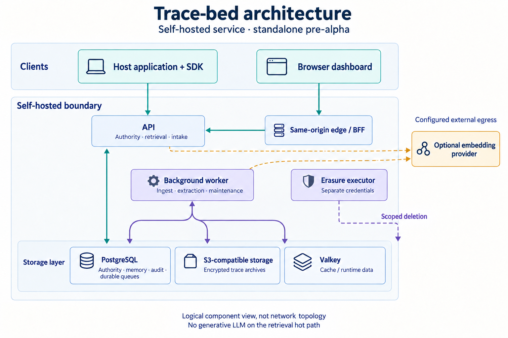

# Tracebed

Tracebed is a standalone, open-source service for collecting execution evidence, deriving bounded memory candidates, and returning a bounded context block for a later request. It is a sidecar for an application that already owns its users, decisions, and prompts.

It is pre-alpha (`0.1.0`). The repository provides source and local-test evidence, not a production-readiness, security-assurance, performance, privacy, availability, or measured-agent-improvement claim.

## Navigate

- [Quick start](#quick-start)
- [How it works](#how-it-works)
- [SDK delivery](#sdk-delivery)
- [Configuration and model providers](#configuration-and-model-providers)
- [Operations](#operations)
- [Status and limits](#status-and-limits)
- [Documentation](#documentation)

## Quick start

The supported local evaluation path is Linux, Python 3.13, `uv`, Git, Docker Engine, Compose v2, and `iproute2`. Node is needed only to develop the dashboard.

```bash
git clone https://github.com/kirti34n/Trace-bed.git
cd Trace-bed
uv sync --locked --extra dev
uv run python scripts/local_demo.py start
```

The command prints the loopback dashboard origin. Use only the launcher for this demo:

```bash
uv run python scripts/local_demo.py status
uv run python scripts/local_demo.py stop
```

The launcher owns its fixed network, secret files, admission fencing, and persistent local state. Do not replace it with raw Compose commands or treat its loopback topology as a public deployment recipe. See [operations](docs/OPERATIONS.md).

## How it works

[](docs/assets/diagrams/architecture.png)

This is a logical component view, not network topology. Read the accessible descriptions and source
map in [Architecture](docs/ARCHITECTURE.md).

1. A host authenticates to the API and submits a retrieval request.
2. Tracebed derives project scope and grants server-side, opens an authorized run, and returns a bounded context block or an empty result.
3. The host may queue trace, feedback, and proposal evidence for later server-side processing.
4. Background components can derive lower-trust candidates from recorded evidence. A candidate is not proof of correctness, promotion, or agent improvement.

PostgreSQL holds durable project, run, queue, memory, and audit-adjacent records. Valkey is cache/runtime data, not the durable queue. The SDK and server use cooperative deadlines: they stop starting later work when the budget expires, but they do not claim native cancellation of an already-running socket, provider call, pool health check, or synchronous parser.

<details>
<summary>Route and authority summary</summary>

| Surface | Authority | Purpose |
|---|---|---|
| `POST /v1/retrieve`, trace, proposal, invalidation | `data` | bounded retrieval and evidence intake |
| `POST /v1/feedback` | source-bound `feedback` | outcome intake |
| `GET /admin/*` | durable grant / `admin` as applicable | scoped operator views |
| `GET /export/project` | `export` | bounded project export |
| erasure request routes | requesting principal / `erasure_request` | durable fencing and status, not deletion proof |
| `GET /healthz`, `GET /readyz` | none / readiness token | liveness and protected readiness |

Project, principal, grant, and run ownership are server-derived. Callers do not select a project through retrieval or evidence route bodies.
</details>

## SDK delivery

This walkthrough is separate from the loopback dashboard demo above. It requires an API endpoint
operated through the authority lifecycle and a provisioned principal with a `data` grant and its
own credential. The demo provisions its dashboard session and seed data internally; it is not an
SDK credential-issuance guide and does not print or expose a reusable API key. See
[owner onboarding for an existing project](docs/OPERATIONS.md#owner-onboarding-for-an-existing-project)
for the supported owner-only registration path and its initial-project limitation.

```python
import os
from datetime import UTC, datetime

from tracebed.domain.events import RunContext, RunStart, StateNote
from tracebed.domain.ids import RunId
from tracebed.sdk import TracebedClient

client = TracebedClient(os.environ["TRACEBED_URL"], api_key=os.environ["TRACEBED_API_KEY"])
result = client.retrieve(agent_type="support-agent", run_ctx=RunContext(query_text="How do I reset my password?"))
# Give the returned, labelled data block to the host's own prompt or tool-input policy.
host_input = {"question": "How do I reset my password?", "recalled_context": result.context_block.rendered}
run_id = RunId(result.run_id)
client.trace(run_id, RunStart(type="run_start", ts=datetime.now(UTC), payload={"query_text": "How do I reset my password?", "tool_manifest": []}))
client.trace(run_id, StateNote(type="state_note", ts=datetime.now(UTC), payload={"note": "host completed"}))
client.run_end(run_id, "ok")  # appends the sentinel, then performs a cooperative flush
report = client.flush()  # explicit reporting; this later pass may already be empty
```

The host decides whether and how to consume `result.context_block`; a returned context is not evidence that it was delivered to a user or model, or that it improved an outcome. `run_end(...)` returns `None`; `flush()` returns the `FlushReport`. `trace`, `feedback`, and `propose_memory` append to a bounded in-process FIFO and do no HTTP or JSON serialization on the caller path. A trace receives its sequence at append time; retries retain the same trace sequence, feedback event identity, and frozen first-send JSON payload. A retryable network error, `408`, `429`, or `5xx` stops that flush pass and returns failed and unattempted work to the FIFO head for a later pass. A terminal HTTP failure or serialization failure drops that item once.

`FlushReport.sent` counts accepted HTTP work in that call, `dropped` reports terminal local loss since the preceding explicit flush, and `pending` includes queued plus leased work. Capacity includes in-flight leases. Ordinary overflow drops the oldest queued item; when every slot is leased, a new item is rejected and counted because an in-flight retry candidate cannot be evicted safely.

Retries can produce at-least-once delivery of a particular accepted payload when an accepted response is lost. This is neither guaranteed delivery nor ingress exactly-once: terminal failures and bounded-buffer overflow can lose work. The run-sequence counter map remains unbounded for a long-lived SDK process because evicting live run state could restart a sequence; durable spooling and strict cancellable shutdown are not implemented.

An isolated authority/restart acceptance sequence observed one unlabeled 503 and one feedback 500 after 5004 ms; a later full run passed without a runtime change. Their cause remains unknown, and this is not a reliability claim or a documented resolution.

## Configuration and model providers

The embedding factory shares `LLMProviderConfig.api_key_env` and `LLMProviderConfig.base_url`
with background generation. The default `gemini` embedding driver builds a `GeminiEmbeddingClient`
for OpenAI-compatible `/embeddings` requests, so query text can leave the service during
retrieval under `retrieval.embed_timeout_ms`. The following is required configuration shape, not
a verified turnkey provider setup:

```text
TB_LLM_API_KEY=operator-managed-paid-key
TB_LLM__BASE_URL=https://generativelanguage.googleapis.com/v1beta/openai/
TB_EMBEDDING__DRIVER=gemini
TB_EMBEDDING__MODEL_ID=gemini-embedding-2
TB_EMBEDDING__MODEL_VERSION=operator-recorded-provider-version
```

`model_version` is required local metadata; the request sends only `model` and `input`, so it
does not verify an immutable remote revision. The configured 768-dimensional pin is also a local
response/storage expectation, not an output-dimension request. Google's
[embedding guide](https://ai.google.dev/gemini-api/docs/embeddings) documents a default
3072-dimensional output and a separate output-dimensionality control; its
[Gemini Embedding 2 reference](https://ai.google.dev/gemini-api/docs/models/gemini-embedding-2)
lists 128–3072 supported dimensions. This repository has not made a paid request or validated
that Gemini's OpenAI-compatible endpoint accepts the needed dimension control. Live provider
compatibility and dimension validation remain release gaps; do not treat this example as a
confirmed deployment recipe.

The default base URL is Gemini's OpenAI-compatible endpoint. An operator may configure another
endpoint, but this repository does not validate arbitrary provider or gateway compatibility. The
operator remains responsible for credentials, provider terms, data egress, spend limits, and
model/version verification. `hash-local` needs no provider key and is useful for offline
evaluation, but its hashed unigram/bigram projection is not a semantic-model substitute.

Generative judge/distiller configuration uses the same base URL and key environment variable but
does not activate a complete learned-memory loop: background provider wiring and production
activation evidence remain incomplete. No *generative* LLM call is reachable from the retrieval
hot path; configured external embedding is the explicit exception.

Automatic candidate extraction is an accepted product direction, but production activation policy is pending an operator decision about review granularity. Do not infer that a candidate has been approved, promoted, delivered to a user, or improved a host application.

## Operations

```bash
uv run python scripts/capability_check.py --check
uv run ruff check src tests harness scripts
uv run mypy
uv run pytest -q -m "not integration"
```

The local demo is isolated from a general deployment. A deployment owner must supply identity, TLS/networking, secret rotation, retention, backup/restore, monitoring, incident response, provider data handling, and authorization review. [Operations](docs/OPERATIONS.md) and the [threat model](docs/THREAT-MODEL.md) describe those boundaries.

## Status and limits

- Selected-for-response and retrieval-event records describe the final result Tracebed returned. They do not prove the host delivered that context to a user or model.
- Database records are not a complete security or operator audit sink.
- The local demo imports labelled evidence after execution; it is not native agent telemetry and does not prove a real-agent learning loop.
- Private-runtime integration and real-agent pilots are future work, not prerequisites for installing this standalone service.
- Erasure fencing and local Compose evidence do not establish deletion from backups, external systems, legal holds, or a production deployment.

Read the generated [capability contract](docs/CAPABILITIES.md) before relying on a feature.

## Documentation

- [Documentation index](docs/README.md)
- [Adapter guide](docs/ADAPTER-GUIDE.md)
- [Memory flow](docs/MEMORY-FLOW.md) and [data lifecycle](docs/DATA-LIFECYCLE.md)
- [Operations](docs/OPERATIONS.md), [threat model](docs/THREAT-MODEL.md), and [release policy](docs/RELEASE-POLICY.md)
- [Contributing](CONTRIBUTING.md), [security](SECURITY.md), [governance](GOVERNANCE.md), and [support](SUPPORT.md)

## License

[Apache-2.0](LICENSE).
