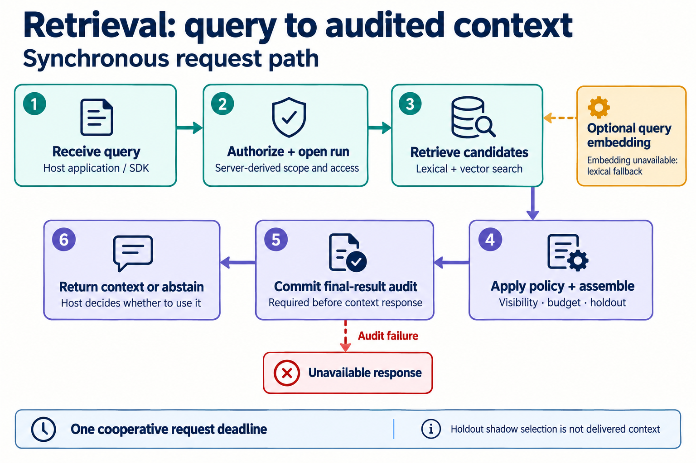

# Tracebed architecture

> This is a code-grounded logical component view of the standalone service. It is not a network
> topology, deployment diagram, security boundary proof, or claim that a host delivered context to
> a user or model. For current capability status, read [CAPABILITIES.md](CAPABILITIES.md).

## Navigation

- [System overview](#system-overview)
- [Retrieval request path](#retrieval-request-path)
- [Evidence and candidate path](#evidence-and-candidate-path)
- [Source map](#source-map)

## System overview

The diagram separates host and browser clients from the self-hosted service boundary. PostgreSQL
holds authority, memory, audit-adjacent records, and the durable work queue. S3-compatible storage
holds encrypted trace archives. Valkey holds cache and runtime data; it is **not** a queue. The
erasure executor's dashed arrow means scoped deletion across the storage layer, rather than a
Valkey-only operation.

Browser traffic reaches the same-origin edge/BFF, which keeps its browser session in an HttpOnly
cookie and forwards authorized API work. A host application instead uses its own direct API
credential. These are separate authentication paths; neither diagram is a network-topology or
deployment-security proof.

The optional external provider is an embedding service. A configured retrieval can send query text
to it under the embedding sub-budget. The retrieval hot path does not call a generative LLM. A
configured provider, an embedding result, or a stored candidate does not establish approval,
delivery, or agent improvement. See the [diagram asset provenance and maintenance prompts](assets/diagrams/README.md)
before regenerating an image.

## Retrieval request path

1. A host application or SDK submits a query.
2. The API derives scope and access server-side, then opens an authorized run.
3. Retrieval combines lexical and vector candidate search. Query embedding is optional; an embedding
   failure can leave lexical retrieval available.
4. Assembly applies visibility, budget, holdout, abstention, and packing rules.
5. The final result is built before its required terminal audit record is written in the authorized
   hold transaction. Audit failure produces an unavailable response rather than context.
6. The API returns context or an abstention. The host retains the decision whether and how to use a
   returned context. HOLDOUT shadow selection is not delivered context.

The request budget is cooperative and shared across stages. It can prevent later work from starting
and narrow supported pool/query timeouts, but it does not forcibly cancel a running native socket,
pool health check, provider call, or synchronous parser.

## Evidence and candidate path

1. The host sends trace evidence. The SDK uses a bounded in-process buffer and retries delivery on
   some failures; this is not durable client spooling.
2. The intake boundary authorizes and enqueues accepted trace, feedback, or proposal work. A `202`
   acknowledges intake, not worker completion.
3. For trace work, a worker processes and archives trace payloads in encrypted S3-compatible
   storage. Feedback and proposal payloads have their own intake consumers; they do not all enter
   this trace-learning sequence.
4. A trace-learning job for a completed trace is claimed from PostgreSQL with a lease fence.
5. The Tier-A/v1 lane performs structural extraction from that trace. It does not make a generative
   LLM call.
6. Fenced trace-learning finalization records candidate material and provenance. Later retrieval
   remains governed by status, visibility, policy, and configuration.

Accepted evidence is not necessarily processed, a candidate is not necessarily approved, and neither
is evidence that a host or agent improved. The repository does not claim a complete real-agent
learning or efficacy loop.

## Source map

| Diagram concern | Source starting points |
|---|---|
| Browser dashboard and same-origin edge/BFF | [edge main](../src/tracebed/edge/main.py), [dashboard source](../dashboard/src/) |
| API composition, pools, queue, retrieval pipeline | [API main](../src/tracebed/api/main.py), [v1 routes](../src/tracebed/api/routes_v1.py) |
| Request admission, authentication, scope, and authorized run hold | [dependencies](../src/tracebed/api/deps.py), [retrieval admission](../src/tracebed/api/retrieval_admission.py), [authority store](../src/tracebed/stores/pg/authority.py) |
| Retrieval, deadline ladder, assembly, and rendering | [pipeline](../src/tracebed/hotpath/pipeline.py), [retriever](../src/tracebed/hotpath/retriever.py), [assembly](../src/tracebed/hotpath/assembly.py), [search store](../src/tracebed/stores/pg/search.py) |
| Terminal selected-result audit | [pipeline](../src/tracebed/hotpath/pipeline.py), [repository](../src/tracebed/stores/pg/repo.py), [authority store](../src/tracebed/stores/pg/authority.py) |
| Durable queue and consumers | [PostgreSQL queue](../src/tracebed/stores/pg/queue.py), [worker runner](../src/tracebed/workers/runner.py) |
| Trace intake and encrypted archive | [trace writer](../src/tracebed/ingest/trace_writer.py), [trace archive](../src/tracebed/ingest/trace_archive.py), [S3 store](../src/tracebed/stores/tracestore/s3.py) |
| Trace-learning jobs and Tier-A candidate finalization | [coordinator](../src/tracebed/workers/trace_learning_coordinator.py), [Tier-A lane](../src/tracebed/workers/tier_a_lane.py), [trace-learning store](../src/tracebed/stores/pg/trace_learning.py) |
| Cache/runtime data | [Valkey stores](../src/tracebed/stores/valkey/) |
| Embedding adapters | [factory](../src/tracebed/adapters/embedding/factory.py), [Gemini client](../src/tracebed/adapters/embedding/gemini.py), [hash-local client](../src/tracebed/adapters/embedding/hash_local.py) |
| Erasure coordination and storage adapters | [erasure package](../src/tracebed/erasure/), [PostgreSQL adapter](../src/tracebed/stores/pg/erasure.py), [trace-storage adapter](../src/tracebed/stores/tracestore/erasure.py), [Valkey adapter](../src/tracebed/stores/valkey/erasure.py) |

For integration contracts, use [ADAPTER-GUIDE.md](ADAPTER-GUIDE.md). For the data and erasure
boundaries, use [DATA-LIFECYCLE.md](DATA-LIFECYCLE.md) and [THREAT-MODEL.md](THREAT-MODEL.md).
