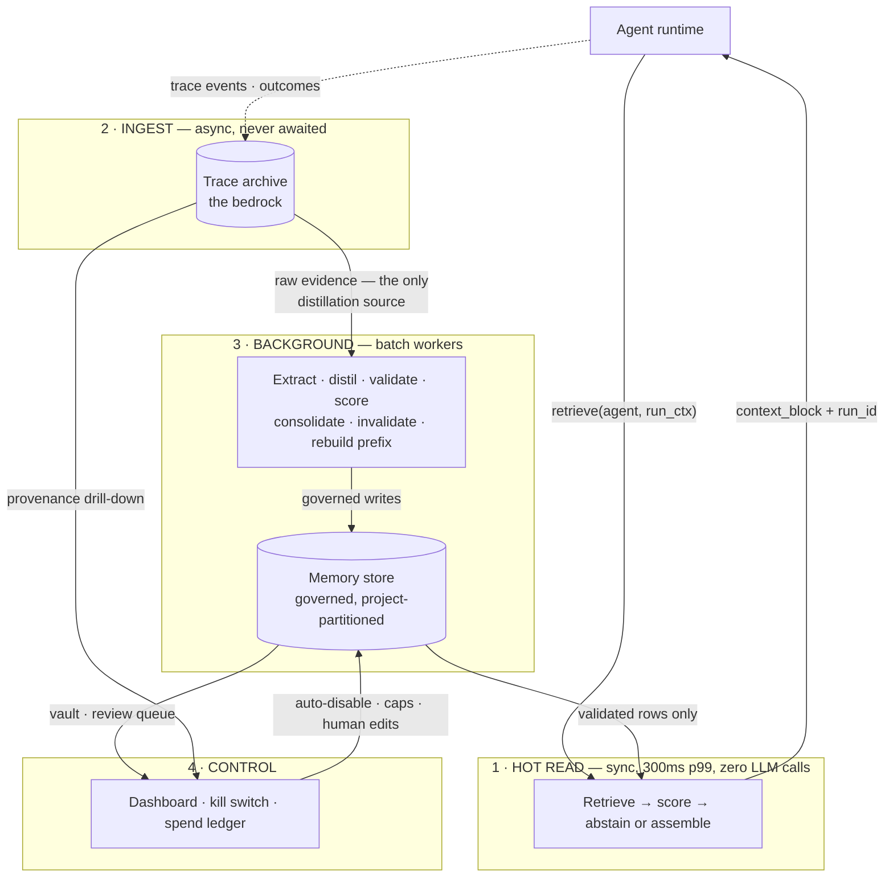
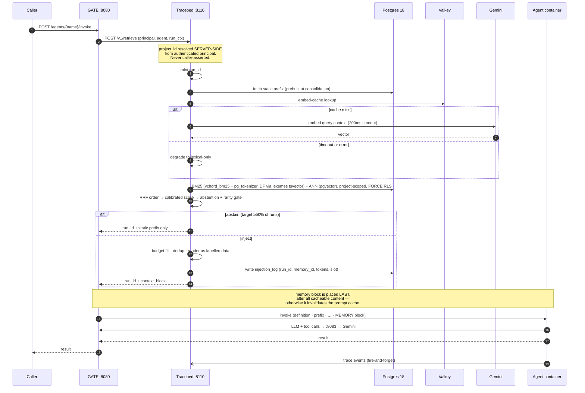
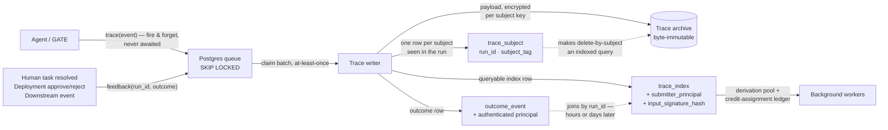
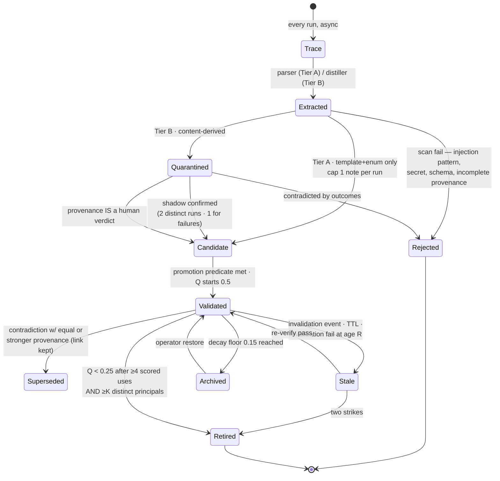
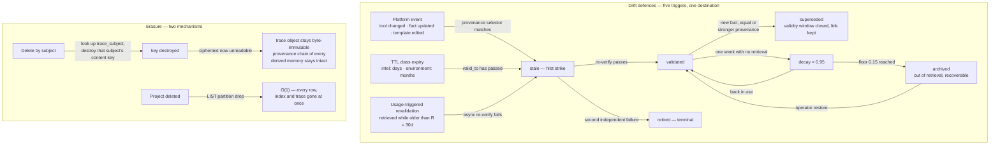

# Tracebed — Memory Flow & Lifecycle

> Read path, write path, learning loop, and the full lifecycle of a single memory —
> from the trace it stands on to the day it is retired.
>
> Rev. 2026-07-25 · API `:8110` · Dashboard `:8111`
> Rendered version: `MEMORY-FLOW.html`

Tracebed watches every agent run, derives lessons from what actually happened, and
refuses to put anything into an agent's context until it has earned the space.

**Budgets at a glance**

| Parameter | Value | On miss |
|---|---|---|
| Total retrieval | 300 ms p99 | static prefix only, then nothing |
| Query embed | 200 ms | degrade to lexical-only |
| Abstention target | ≥ 50% of runs | inject zero dynamic tokens |
| Memory envelope | 1,200 tokens | 700 static prefix · 500 dynamic |

---

## 1. Orientation — four planes

Nothing in the hot read plane thinks. It searches, scores, and either injects or abstains
inside a fixed budget, then gets out of the way. Everything that reasons runs behind it,
in batch, reading raw traces — never summaries of summaries.



The workers inside plane 3 are enumerated in [§4](#4-the-learning-loop); the detailed
wiring of the read and write paths is [§2](#2-read-path--one-run) and
[§3](#3-write-path--the-trace-is-the-bedrock).

---

## 2. Read path — one run

The recommended attachment inside Atom is an audit-only fifth GATE mux modelled on
`aegisGate:8084`, with GATE performing the injection. GATE already resolves the agent
endpoint and rewrites the request, so memory reaches production agents with **zero
agent-code changes** — no codegen prompt edits, no new lint patterns.



> **Load-bearing.** Abstention is *not* computed from the RRF score. RRF discards score
> magnitudes by construction — its output encodes consensus **rank**, not relevance, and a
> rank cannot be thresholded for "good enough to inject". RRF orders the candidates; the
> inject/abstain decision comes from calibrated raw signals: normalised BM25 score and
> cosine similarity.

---

## 3. Write path — the trace is the bedrock

Everything writes to the trace first. Memory is derived; run content never writes memory
directly. Nothing on the write side is awaited by the agent runtime, and an outcome event
joins its trace by `run_id` whenever it lands — an analyst disposition two days later
simply attaches.



---

## 4. The learning loop

Two lanes. The operational lane is pure code — parsers over execution signals — so it works
on projects where nobody ever grades the work. The quality lane exists only where a
feedback adapter does.

| Worker | Reads | Produces | Model | Cadence |
|---|---|---|---|---|
| **Extractors** | raw traces | Tier A operational lessons, derived state | none | near-real-time |
| **Distiller** | raw traces | Tier B quality lessons, episodic exemplars, semantic conclusions | Gemini 3.1 Pro | batch, novelty-gated |
| **Shadow validator** | quarantined + later outcomes | promotion to candidate | Gemini 3.1 Pro | on matching outcome |
| **Scorer** | outcome → trace → injection_log | Q updates | Gemini 3.1 Pro | ≤1 update / memory / day |
| **Consolidator** | the vault | merge, dedup, contradiction, decay, archive | none | nightly, per project |
| **Invalidator** | events, TTL, usage | stale marks, two-strike retirement | none | continuous |
| **Prefix builder** | validated + pinned | static prefix per agent-type | none | after each sweep |

> **Spec correction.** The Q update as specified in `MEMORY_PLAN.md` §9 punishes success:
> it feeds the adapter *weight* in as the reward. From the mandated start of Q = 0.5, a
> successful downstream event (weight 0.3) yields `r − Q = −0.2` and **lowers** the score.
> The weight expresses how much the signal is *trusted*, not how good the outcome was.
> Corrected form:
>
> ```
> Q ← clamp01(Q + α · w · c · (r − Q))
> ```
>
> where `r` is outcome polarity in [0,1] and `w` modulates the learning rate.

---

## 5. The life of one memory

One reconciled state machine — the spec shipped two that disagreed (§8's diagram vs §12's
status enum). Transitions are the **only** way status changes; there is no administrative
bypass in code.



**State legend**

| State | Meaning |
|---|---|
| `quarantined` | content-derived, **never injected** under any condition |
| `candidate` | injectable, rendered with a lower-trust label |
| `validated` | in the static prefix and the dynamic slice |
| `superseded` | validity window closed, link kept for temporal queries |
| `stale` / `archived` | out of retrieval, recoverable |
| `retired` / `rejected` | terminal |

> **Disabled at launch.** The "corroborated by 2+ independent traces" shortcut ships
> switched **off**. Independence cannot be computed from the original schema — with only
> `run_id` to distinguish rows it degrades to "submitted twice", a two-call bypass of
> shadow validation. Published measurement (GovMem, arXiv:2607.02579) puts naive
> count-based corroboration at a **0.597 false-promotion rate**. The skip re-enables once
> independence means differing `submitter_principal` **and** differing
> `input_signature_hash` cluster.

---

## 6. How a memory earns and loses its place

| Stage | Trigger | Effect on Q | Guard |
|---|---|---|---|
| Promotion | predicate met | `= 0.50` | provenance complete, or rejected at insert |
| Positive outcome | verdict · correction · downstream | `+ α·w·c·(1 − Q)` | unambiguous outcomes only |
| Negative outcome | verdict · correction · downstream | `− α·w·c·Q` | ≥ K distinct authenticated principals |
| Ambiguous / implicit | regenerated, abandoned, rephrased | no change | logged on trace, never scored |
| Idle decay | one week unused | `× 0.95` | archive at floor 0.15 |
| Retirement | Q < 0.25, ≥4 scored uses | terminal | else routed to the review queue |

The principal threshold on negative outcomes closes a live hole. Run the specified
arithmetic with `c ≈ 1` and `r = 0`: `0.5 → 0.35 → 0.245 → 0.172 → 0.120`. Four scored
uses — exactly the retirement precondition — at one update per day means **four calendar
days to retire any memory an attacker chooses**, using outcomes the system is designed to
trust precisely because they are unambiguous.

**Feedback adapters**

| Adapter | Example | Weight `w` | Role |
|---|---|---|---|
| Explicit verdict | analyst approve/reject with reasoning | 1.0 | gold; rejection reasons feed the distiller |
| Correction | human edits output before use; the diff is the signal | 0.8 | per-project integration |
| Downstream event | ticket closed, case reopened, alert re-fired | 0.3 | weak, delayed, joins whenever it arrives |
| Implicit behaviour | regenerated, abandoned, retried | 0.0 | logged only — a guessed reward is worse than none |

---

## 7. Staleness, erasure, and the end of a project

Forgetting is a subsystem, not cleanup. The success criterion is that the vault
**plateaus** while run volume keeps growing — that is what keeps per-project cost flat.



Crypto-shredding resolves a genuine contradiction in the spec: the trace is
*simultaneously* the erasure target and the audit record. Encrypting payloads under a
per-subject key means erasure is key destruction — the object stays byte-immutable, the
provenance chain of every derived memory survives, and the subject's data becomes
unreadable.

---

## 8. The boundary — what a host implements

Tracebed is a standalone service. Everything host-specific sits behind a port with a
working default, so integration is configuration plus a handful of adapter
implementations — never a fork.

Port names below are the ones in the code (`src/tracebed/adapters/ports.py`, plus
`stores/tracestore/__init__.py`), not prose names. They were all eight wrong in an earlier
version of this table — `PrincipalResolver` for `PrincipalPort`, `ObjectStore` for
`TraceStorePort`, and so on — which matters more here than anywhere else in this document,
because the user's instruction is "you create the standalone service, I will integrate with
Atom myself" and this table is the contract that integration is written against.

| Port (module) | What it answers | Default in the box | Atom implementation |
|---|---|---|---|
| `PrincipalPort` (`adapters.ports`) | who is calling | OIDC / JWKS · API key | Keycloak realm `atom`, NHI client |
| `ProjectResolverPort` (`adapters.ports`) | which project this principal belongs to | registry table, set at registration | Atom project entity |
| `FeedbackPort` (`adapters.ports`) | what counts as an outcome | verdict · correction · downstream | `/tasks/{id}/resolve`, deployment review |
| `InvalidationPort` (`adapters.ports`) | what changed in the world | HTTP webhook + polling | tool/spec/template change events |
| `LLMProviderPort` (`adapters.ports`) | generation for the workers | Gemini, OpenAI-compatible | LiteLLM via `gate:8083` |
| `EmbeddingPort` (`adapters.ports`) | vectors | Gemini (`onnx-local` is declared but raises — D-107) | Gemini; the local driver is not implemented |
| `TraceStorePort` (`stores.tracestore`) | where traces live | filesystem · S3-compatible | SeaweedFS or existing bucket |
| `AuditSinkPort` (`adapters.ports`) | where decisions are recorded | **nothing yet** — see below | HMAC-signed events |

`AuditSinkPort` has **zero implementations** in this tree and no migration creates an audit
table, so "Postgres + structured stdout" — which this table used to advertise as the default —
does not exist. No governance action (a kill-switch decision, an operator edit, a quarantine) is
recorded anywhere today. It is listed with a size in PLAN.md's known-gaps section; until it
lands, treat the audit column of any integration plan as unimplemented rather than pluggable.

**Integration options, ranked**

1. **Fifth GATE mux, GATE-side injection** — *recommended*. Audit-only, modelled on
   `aegisGate:8084`. No agent-code changes, no codegen prompt edits, ADR-009 satisfied
   literally. Costs Go changes in `gate/`.
2. **SDK inside the agent** — works, but reaches production agents through an LLM-written
   call checked by a regex lint, and misses CLI-scaffolded agents entirely.
3. **Memory as a tool behind `/tools/{name}/invoke`** — *rejected*. AgentArmor's 5 s
   pre-call timeout alone is 16× the whole retrieval budget, and it hands the model the
   decision of *when* to retrieve, which destroys the abstention economics.

---

*See also: `../PLAN.md` (architecture and phases), `../DECISIONS.md` (why each choice was
made), `../PHASE-0.md` (the executable task breakdown).*
